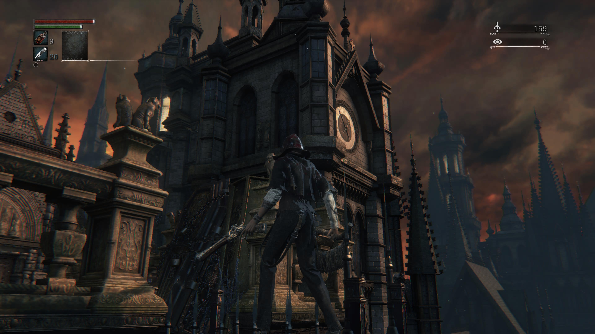
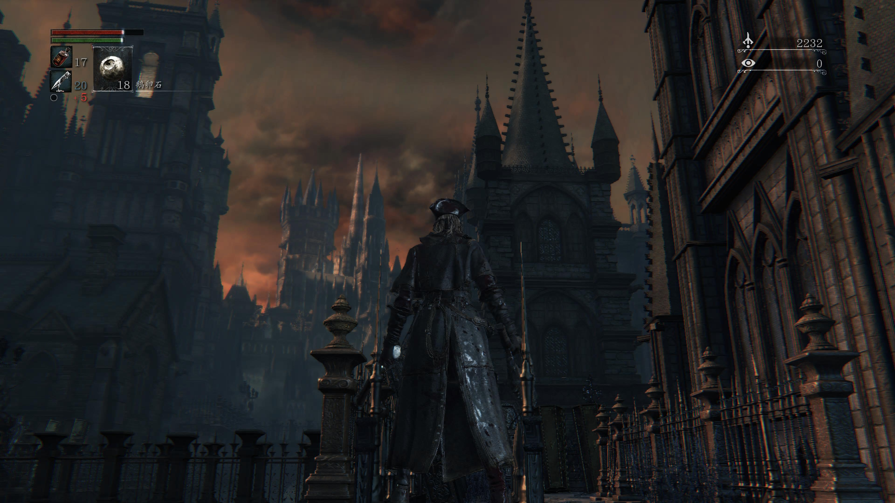

# 游戏
## 幽灵诡计

我买了幽灵诡计来接档王国之泪！

去年玩《逆转裁判》上头之后，我曾经通过使用 NDS/3DS 模拟器补上世代的逆转作品，包括逆转裁判4和逆转检事12。期间我也尝试过这部饱受赞誉的巧舟的小品级作品，只是比起逆转系列的 AVG 形式，这部作品多了太多操作的部分，而上世代游戏机的双屏也很难在手机屏幕上拥有比较好的游戏体验。

说人话就是，上次我没过开局的新手教程。上一次的体验非常有限，只记得主角是一个屁股朝上的红色尖尖头。所以看到重制消息的时候，我并没有那种望穿秋水的期待。不过，巧舟拥有高评价的早期作品，在我这里仍然值得一玩。抱着这样的心态，我购入了卡带。

实际游玩后，这部作品给了我相当大的惊喜。无论是叙事的节奏，还是精巧的解密设计，这都是一份相当优秀的作品。紧凑的叙事和悬念的吸引让我无暇在游玩期间打开嗼嗼放送我最爱的怪话，更是成为了第一部让我在周五下班后打到凌晨、耗尽 NS 掌机模式电量的游戏。

作为一部长度 10 小时的短篇游戏，《幽灵诡计》在我这里的评价甚至略高于《逆转裁判123》。巧舟式的人物塑造让这个以死亡为背景的故事基调变得风趣而诙谐，“一夜”的时间限制、章节推进过程中不断抛出的悬念也促使玩家不断往下游玩。另外，这还是一个令小动物爱好者狂喜的游戏！通关之后我发现我的 ns 相册里多了一整页小狗的截图，有人有什么头绪吗？

如果说《逆转裁判》的某几章会让我发出“巧舟太厉害了”的赞叹，那么打完幽灵诡计，我的心情只剩下：巧舟，你是我的神。

*PS: 这个游戏的任何剧透都会极大减损游戏体验，请务必带着一个没有玩过幽灵诡计的脑子开始游玩！*

## 血源诅咒

2023年7月16日是我和我素未蒙面的梦中情游 BloodBorne 相遇的那一天。起初我只是在游戏论坛随意寻找值得玩的二档会员游戏，直到血源诅咒这个名字映入我眼帘那一刻，我也只是随意地把它记了下来，并没有给它过多的关注。那个时候我还不知道我将坠入爱河。

弃掉上一个游戏的深夜，我下载了血源并开始了长达一小时的捏脸。第二天上午，我踏足了亚南。维多利亚时代的背景，哥特式的建筑风格，克苏鲁神话体系。我毫不夸张的说，看到这个哥特尖顶的第一眼我就陷进去了。

三天之后的晚上，我通过了篝火晚会。一周之后的周末，我在无数次失败后枪反处决了神父。这个游戏真的完全长在我的审美点上。沉迷血疗的城镇，缓慢降临的夜晚，逐渐揭露的真相。独特的艺术风格，近乎疯狂的“死斗感”的战斗设计，华丽、阴沉、神圣、恐怖。我完美的梦中情游，为什么我人生的前24年完全没有听说这个游戏？

关于血源我想说的太多，除了月度记录外，大概还会在通关后单独开一篇文章写一写历程。这里不再赘述。

# 观影
## 芭比

首先，我小时候没有玩过芭比。

在上映后铺天盖地的 feminist 营销下，我抱着一种“闲着也是闲着”的心态去了电影院（所以为什么是芭比呢？我上半年想看却没有看的电影至少有 DND 和天空之城）。出场之后我去吃了一顿烧烤，在酒精和夜风下对这部电影感到非常迷茫。

《芭比》为什么这么拧巴？在互联网观看了一整天“男的看完芭比破防了”主题营销下，我甚至差点以为这会是什么炮火连天的激进女权主义革命电影。实际看完后，我只觉得这片子温和得像在挠痒痒，甚至不舍得摘去那层粉色糖衣。全片最激进的部分是开头砸烂婴儿玩偶，以及女儿在真实世界见到芭比之后那段尖刻的评价。至于那段在全网买了营销转发的妈妈的慷慨陈词，实际观看体验中更像是为了迎合受众的特意打造的爆款时尚单品。

我一度想问，这部电影究竟表达了什么？芭比迈向人类世界的步伐始于自己的脚成了平底、腿上长了腿纹，得赶紧去人类世界想办法变回来；而她回到芭比城堡后发现城堡变成了肯的 mojo dojo casa house 之后，崩溃大哭着说我不聪明不漂亮了，而这时人类妈妈的安慰是，你已经很聪明很漂亮了。

这部电影对父权制相关的一切描述的无比真实——真实到让我产生了过多与现实相关的联想而感受到了严重不适，与此相对的，芭比作为芭比城堡的第一性的表现则虚浮到带着童话般的泡沫。不用治国理政的芭比总统、不用做急救的主治医生和不用提出发明的诺贝尔奖获得者，在父权制入侵之后却需要真实的穿着暴露的衣服做服务工作和陪酒。儿戏性的夺权也始终脱离不了性缘关系，而在夺权之后，居然还让实行了这一切压迫的肯说上一句：“呜呜呜，我当领导也很累很辛苦”这种平权式端水发言，谁问你了？

父权制之后还有资本主义：虽然我们芭比公司的高层是13个开局就准备上来干一票绑架的全男天团，但我们没有一点坏心眼，我们真的是为了让小女孩实现梦想而不是赚钱才开了这么大一个公司，我们还在某一层楼给创始人老奶奶建了个独立办公室，不说了，让我们大家都来挠对方痒痒吧，我这个公司高管的唯一愿望只是想让大家在一起挠痒痒。

虽然这部电影确实贡献了一些梗比如男人和马/mojo dojo casa house，但我很难不认为这就是个不想得罪任何人的不粘锅商业片。影片结束后，什么都没有改变，芭比世界中芭比继续作为优势性别压迫肯这个无法成为大法官的第二性，现实社会的女性处境没有丝毫改变，美泰依旧兜售他们用少女梦包装的消费主义和外貌规训，而芭比毫无铺垫的来到了这个残酷的现实世界变成了人。这个结局让我一度失语。既然选择生活在这个水深火热的父权制世界，我祝你好运吧。

# 逛展
## 博物馆

原本是想去看青铜器和庞贝展的。不过青铜器展没有什么特别吸引我的展品，至于庞贝展，真的不值得看。展品平平无奇，策展方更是在黑暗的场馆用投影在墙上投了一堆适合发小红书或者朋友圈的非常令人尴尬的青春疼痛文字。去了之后发现展品不一定有人看，但每一段投影文字前都有至少四五个人咔咔狂拍，原来是双向奔赴。

原本没抱期待的麦积山石窟展倒是意外的不错。图一的木雕实物很大，现场看非常精细。图二石雕的衣纹也很惊艳。请看！

