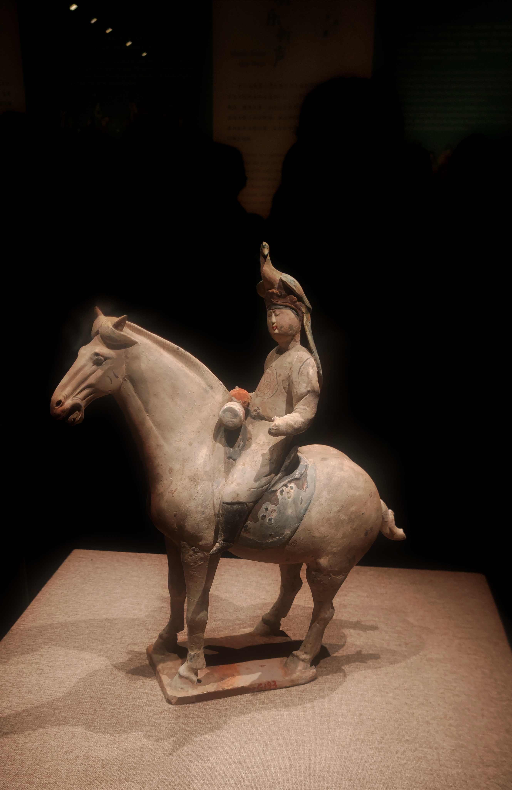
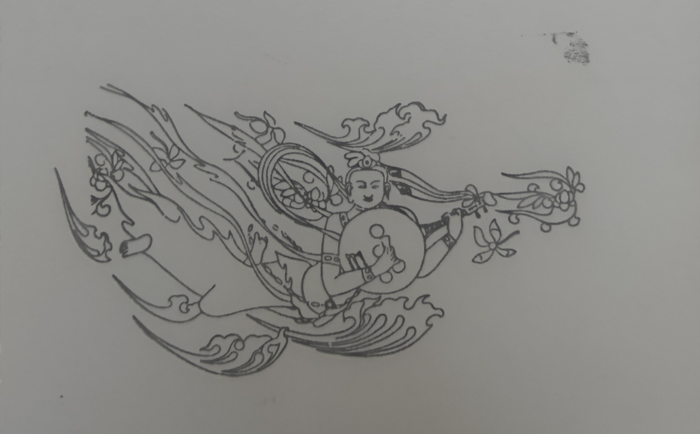

## 读书

我家里书架上的书多数是我读高中时买的，其中的一些我至今都没有读过。其实我选书的品味并没有发生太大的变化，然而阅读能力却与日俱减。想起从前爱去书店，每每都能带回一两本感兴趣的书。后来出省读书，如今在外打工，都需轻装简行，算来已有数年不曾买书了。

Kindle 没什么不好，搭配 Zlib 更是绝佳，只是它确实是个容易被随时放下的电子产品，我仍然想念纸质书的厚重、翻阅的手感。从前不以为意，现在才购入纸质书对于我来说竟已成为一种奢侈。但最为可惜的是，在无数碎片化信息的充斥下，以及确实繁忙的工作之后，我似乎真的失去长久阅读一本书的能力了。
### 《白夜行》

这本书也是我高中时候买的。其实我一本东野圭吾都没有看过，纯粹是在书店显眼处看到了就买了。买回来也没有看，在高三运动会带去了学校，结果借给了同桌。同桌看完之后晚自习大骂唐泽雪穗，我这么多年来一直不知道为什么。国庆回家无聊，把我买了没看的书里面最容易读的这本书拿出来，准备一探究竟一下。

好在我的阅读能力虽然退化至此，倒也没有到看不下去通俗小说的地步。

总的来说是好读的。前期情节足够吸引人，尤其喜欢揭晓人物关系前的双线叙事，隐隐透露些许线索，草蛇灰线，伏脉千里。中后期故事个人感觉就比较普通，没有太惊喜的地方，不过结尾真的足够紧凑，具有张力和画面感。

再谈人物塑造。我读完之后看豆瓣短评，才惊觉男女主全书没有说过一句话，也从来没有过心理描写，确实可见功力。

不过即使不讨厌雪穗，也没法对她提起一丝好感，他们行为的动机是临近结尾时的最后一个包袱，只是看到的时候已经提不起同情，她早已扭曲成和她母亲一样的加害者了。反正我最难以共情的一点就是，她真正施加人身伤害或是创伤的加害对象，我有印象的全是女性。杀了害她的生母，我能理解；加害背后传谣的同学、反感她的继女，她那种扭曲的精神状态我也能接受；害从小玩到大的玩伴（不算朋友吧，雪穗这样的人没有朋友的），我觉得属于是雌竞到精神失常；到最后连把自己从泥潭里拉出来、像个贵族小女孩一样养大的养母都要拔管子，我只能说我真服了。

相比之下我觉得她对男的简直太好了点。男大家教自己不保管好涉密资料，完全活该好吧。我最不理解的就是前夫哥了，婚前精神出轨准备悔婚的大屑人忍辱负重也要嫁，过两年还把失散多年的白月光亲手奉上，他不比上面几乎所有被害的女人过分？你对他那么好是因为他上辈子救过你的命吗？为什么不把他杀了吃遗产，你不是做不到吧？升官发财死老公不比你离婚之后百般操作就为了嫁给一个儿女都十岁了的丧偶中年男强？只能说我真的很难评。

## 游戏

### unpacking

九月的二档游戏，在库时间一个月。想起它的时候已经是10月12日了，不过好在流程短，花了两个下班后的晚上，在出库之前通关并白金了。过程很轻松，很适合我高强度打工后一团浆糊的脑子。

我一直觉得游戏是一种最为独特的艺术载体，unpacking 则再次证实了我的这一认知。不同于传统艺术中创作者传递、观众接收这样的单一流向，交互性是游戏的灵魂。

unpacking 是一个将交互性诠释的非常透彻的游戏。走进一个人的房间就像走进一个人的内心，是一个将人的身份、职业、爱好乃至心灵一一展开的过程。开局的主角作为搬家对象还是一个小孩，不知道是否是游戏方刻意为之，有意将一些在刻板印象内更偏向男性或是中性的物件放在这个阶段，使我一度猜错主角的性别，直到下一关青春期中收拾衣柜出现内衣，我才意识到主角是女性。这也让我反思，即使接触女权主义接近十年，我的潜意识当中仍然存在刻板印象和偏见。

第三关主角大学毕业，住进了合租的房子。当我从箱子里拿出一面装帧精美的奖状时，我忍不住哇了一声，我能感受到这一定是对她来说很难得、很重要的物件。然而下一关与一个男的同居，在我废了整个游戏最大的力气，去把这些东西放进这个没什么收纳空间的家，几乎是将她这个人挤进这间房子时，我已经有点烦了；而我在我连续切了几个房间，反复确定这个家已经在墙壁上挂满了这男的的电影海报，全然挂不上这面大奖状时我开始困惑，直到我无意切到房间，发现奖状只能放在床底下，同时报错消失，我真的到达了愤怒的顶峰。

这种男的，不劝分一下就不礼貌了。当我切到下一关，回到幼时的小房间时，已经隐隐有了猜想。这一关和上一关相比非常容易，完全没有难以收纳的卡点。当我拆完箱子后，收到了唯一一个报错。是我顺手挂在墙上的她和那个男的的合照。

我应该把它收起来、扔掉。做完这一件事后，通关按钮亮起。想劝分的对象真的分了，我并没有感到快意，而是感受到此刻传递来怅然的情绪，俱往矣。

她搬进了新的房子。数年之后新成员搬入，是一个拥有非常多漂亮裙子的女孩子，拆她的衣服箱子的时候我老是惊叹，这衣服真好看啊！她喜欢盆栽，同时也喜欢一些奇幻、带克苏鲁风格的物件，比如说一些奇诡的巨大摆件，还有一个 1D20 骰子。这间房子只有一间卧室、一个衣柜，我知道的，她是我们主角新的伴侣。

几年之后她们搬进了新的大房子，拥有一个婴儿房。将所有东西收纳后，游戏结束，轻柔、悠扬的主题曲响起。她说：“感谢你和我一起经历这段旅程。”

在舒缓的女声片尾曲下，我无法不为这样一个简单却深沉的游戏落泪。我再次确信，游戏的伟大之处从来不是燃烧算力获得的精细逼真的次世代画面，而是它通过与玩家的交互所传达的情感。在这样一个小品级的像素风游戏下，我明明从未见过她，却好像真的参与了她直到如今的人生。
## 逛展

### 花月醉雕鞍：大唐金乡县主展

某个周六，打血源到中午，坐牢。出门吃麦当劳，发现阳光太好，觉得继续拉着窗帘打游戏实在可惜，决定享受人生，看一眼博物馆是否有当天的号，发现是有的，预约之。又想起博物馆可以集章，回家碰碰运气看看有没有全白的本子，拆了一本，发现恰好是全白的，非常幸运地出发。

和上次比只有一个新展。如果我纯看展的话，应该会觉得这里并没有什么奇珍异宝。这座墓葬经历过盗墓，连墓葬主人所拥有的一具头冠都只剩下残片，需要考古学家结合文献去做出还原的影像。展品里只有各式各样的泥雕，从审美上看，实在乏善可陈、无甚好看。

但是幸运之处就在于，我遇上了讲解呀。

上一次来是暑假，人多到需要提前一周预约，因为人流量过大，也取消了讲解。现在讲解恢复，在我进展馆简单看了五分钟的时候，讲解员提示讲解即将开始。

讲解员真的很专业诶，连发声方式都能听出是练过的。说是预计讲解时间50分钟，实际上用了一个多小时，但实际听下来，还是觉得内容非常充实，以至于这一个小时过得非常快。

什么样的人能被封为县主？我知道皇帝的女儿是公主，姐妹是长公主，姑姑是大长公主。但郡主和县主是什么人，我以前还真不知道。在这里才得知，原来太子的女儿是郡主，亲王的女儿是县主。

金乡县主是谁？她的父亲是滕王李元婴，造了滕王阁序里的滕王阁。金乡县主生于高宗永徽三年，死于开元十年，享年71岁，相当长寿，比长寿更好的事情就是老公死的早，她在老公死后还活了三十余年。金乡县位于山东，但她不必亲临封地，始终居住在长安，也葬在长安。展出的陪葬泥塑，也展示了当时非常丰富的娱乐方式。

快乐的死老公生活呀……

除了娱乐方式外，展出的泥塑也体现了当时的衣着、妆容和发型样式，讲解提到初唐时女性出门需要穿戴遮盖全身的幂篱，而后转变为遮盖头部的帷帽，到不做任何遮蔽的转变。除了传统的女性着装外，许多女性俑身着男装、胡服，讲解提到太平公主曾经身着男装见皇帝而未受斥责，可以说明当时的社会风气对于女着男装的接受程度。除此之外，展出的骑马演奏、乃至游猎仆从队伍、杂技表演，都能见到女性俑。

在听这些的时候，本宝忍不住想起了自己上辈子做女子高中生时的事情。由于世界线的变动，使得本宝未能在高中就成为一个纯血的理科生，而是得以多学了三年我当时最喜欢的历史。当时学校下发了一个所有人都要做的无聊的综合实践任务，勇敢的组长找了我整个学生时代最喜欢的老师，也是我人生当中唯一一位历史老师做指导老师。当时组长问我们老师，我们选什么题比较好呀，老师说你们组里都是女孩子，应该也对衣着文化感兴趣，就写“由中国古代女性服饰演变透视女性地位变迁”吧。

值得一提的是，这篇东西的唐朝部分恰巧是我写的。时隔多年，我做女高时的资料几乎都已经遗失，唯有这份文件冥冥之中被我保存下来。这是一篇从各种资料中摘录整合、连称作小论文都勉强的论述，当时的我肯定不好意思发出来。不过既然做女子高中生已经是上辈子的事情了，何况做工科生和理工类工作加起来已有多年，我也的确已经连这样的文字都不再能写出来了。因此即使把这段并不专业的论述选段贴出来，也比我现在写的流水话博客强上太多。

 

唐朝作为我国古代史上最繁盛的朝代之一，以其广泛包容、去芜存菁的文化态度，形成了兼收并蓄的文化气韵。就服饰方面来看，唐代女装也逐渐摆脱了汉代袍服的影响，在吸收一些外来因素的基础上，形成了以裙、衫、帔为基本要素的崭新式样。
 
魏晋南北朝时期，由于民族融合，女性主要的款式服饰在秦汉典雅、庄重的基础上，融入了北方游牧民族的特色，并由于道教的盛行，服饰风格趋向于飘逸、洒脱。隋王朝期间，丝织业有了长足的发展。唐朝正是在此基础上，发展出了自己独特的审美意识与服饰风尚。
 
唐政权在风俗习惯上，拥有较多的鲜卑风尚。李唐王室本身具有少数民族血统，又长期与少数民族杂居生活，因而受到了深刻的文化影响，也一定程度上继承了北朝文化。另一方面，唐朝本身是一个民族融合的时代，与少数民族的经济、文化交流空前频繁。对于外来文化广泛包容、兼收并蓄的文化心态，形成了唐文化的风气。而当时的周边少数民族与国家，婚姻关系比较原始，女性受到的约束较少、地位较高。唐朝开明的民族政策也使少数民族风俗不断涌入，有力的冲击了中原汉族文化的封建礼教观念，对唐朝社会风气产生了很大影响。
 
正是由于这种文化特性，使得唐初时期，贵族女性得以在政治舞台上发挥其作用。自武则天以来，活跃在政坛的女性——如太平公主、韦后、上官婉儿等，对唐初的政治都曾产生过较为重要影响。贵族女性在政坛活跃的参政，又强化了社会对女性的接纳、尊重。
 
唐朝贵族女性在出行穿着上，经历了由遮蔽全身的幂篱，至遮蔽面容的帷帽，再至不作任何面容遮蔽的演变。武德、贞观年间，宫人贵妇外出骑马，要戴上幂篱，即一种宽檐、帽檐上垂下可遮住全身的罩纱的帽子，以防止路人窥见身材、面容。唐高宗时代，罩纱缩短至颈部，改称帷帽，只遮住面容。玄宗时代，贵族女性出门则无需任何面容遮蔽，杜甫在《丽人行》中所写的“态浓意远淑且真，肌理细腻骨肉匀。绣罗衣裳照暮春，蹙金孔雀银麒麟。头上何所有，翠微盍叶垂鬓唇。背后何所见，珠压腰衱稳称身”，描写的正是杨贵妃姐妹等贵族女性的出行。
 
唐朝社会的开明风气，在服饰上也体现为“女着男装”风气的盛行和胡服的衣着风尚。《新唐书·五行志》记，“高宗尝内宴，太平公主紫衫玉带，皂罗折上巾，具纷砺七事，歌舞于帝前。太平公主此举，说明了唐初已经出现女着男装的案例。女着男装的风气尤在大唐开元、天宝年间盛行。《中华古今注》记，“至天宝年中，士人之妻，著丈夫靴衫鞭帽，内外一体也。”《新唐书李石传》记，“吾闻禁中有金鸟锦袍二，昔玄宗幸温泉与杨贵妃衣之。”由此可以看出，当时女子仿制男装，穿着男装相当普遍。女性着男服非但未被限制、禁止，反而流行开来，成为社会风尚。由此可见，女性在唐时期受到的社会束缚相对于南北朝时期与之后的明清时期较小，在社会生活中拥有较高的自由。
 
由于印染技术的提高和社会审美的倾向，唐朝的女性服饰色彩较为艳丽。《燕京五月歌·其一》中写道:“石榴花发街欲焚，蟠枝屈朵皆崩云，千门万户买不尽，剩将儿女染红裙。”石榴裙作为唐朝的常见服饰，在民间广泛流行。
 
……



我实在没有想到，在这样一个平凡的午后，在我已经与整个人文社科都阔别多年后的秋日，竟然能够以这样的形式与多年前的自己进行一次仿佛跨越时空的交流。已经时隔太久，我的改变也

另：盖到了实物特别好看的章！

### 广州：塞尔达传说 Only

很长！见：[普通玩家的 Zelda Only 奇遇记](/p/2023-guangzhou-zelda-only)