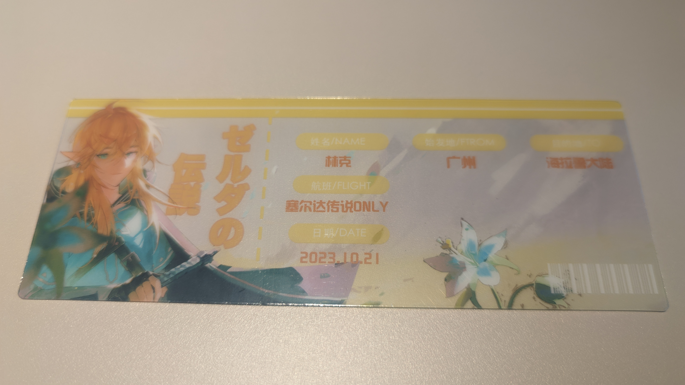
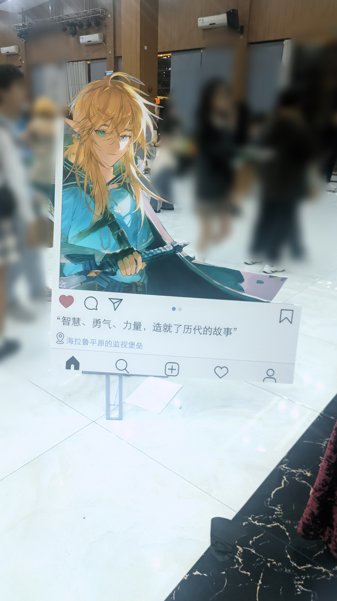
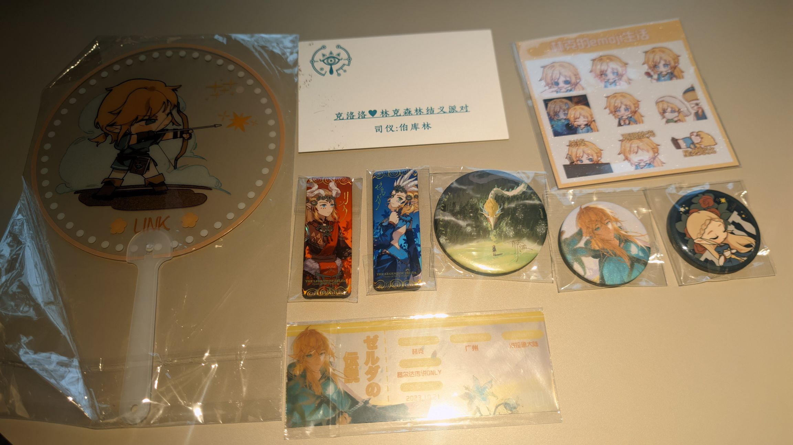

# 逛展

## 广州：塞尔达传说 Only

得知广州要办塞 Only 的途径其实挺偶然的，我某天刷嗼嗼，有好心的大人提到了广州要办塞尔达 Only。看了一下，感觉是可以去的。

其实本人是究极社恐，工作一年多的时候才学会伪装正常人和陌生人社交，虽然对 mbti 不屑一顾，但每次测试结果都是100%i。我从小就很害怕漫展这种环境，之前的两次广州 cp 都在犹豫不决后放弃了。为什么选择去了塞O，一是觉得 Only 展相比综合性的商展环境会更加纯粹，二是某一天突然上头，冲动下单了票。

展期接近时发现游客群里的很多大人都在准备无料，我又开始紧张了，因为我根本不去漫展，不知道准备无料是个怎么样的流程。此时开始不断怀疑我只是个臭打游戏的，真的应该去这种 cosplay 和同人氛围浓厚的展子吗？如果能退票的话，我这个时候就退了！但是退不得，于是我只得安排好了去广州的行程。

### 闪现广州，但是大失败

我的原定行程是 9:00 高铁出发，预计可以在 10:30 开展前到达展厅。展子在周六，我在周五的凌晨两点掐指一算，觉得自己 7:30 起床出发去高铁站应该差不多。算完之后觉得特别严谨，当场定了个 7:30 的闹钟。

几小时后，周五的 7:30，我被自己几小时前定的闹钟吵醒了。 

周六 7:30 我准时起床，短暂思考后得出了自己应该化个妆的结论。悲报是我一年也化不了两次妆，临近出门的时候已经接近八点。第二个悲报是此时的地铁频次不高，导致实际的乘坐地铁时间比我深夜在高德的查询结果多了10分钟。第三个悲报是我太久没坐火车，忘了火车要提前15分钟上车了。

种种原因之下，我进入高铁站的时候已经九点零几分了。不过车到山前必有路，船到桥头自然直。在地铁上确信自己坐不上车的时候我已经开始看改签，此时高铁已经售罄，只有时间长很多的城际列车，但我已经没有选择了！最终我在接近十一点的时候到了广州，简单吃了个午饭后到达展区，此时已经是 11:40 了。

其实交通工具这个载体真的挺奇妙的，似乎总会在旅途当中以微小的细节预示你的目的地。就好像我每次刚坐上回家的飞机就能听到老家方言一样，我上车之后经过某一节车厢，看到地上摆了一袋手作的粘土静谧公主。

我愿意将这一刻称为这次旅途的开始，因为我正是在此时意识到，我正在与很多喜爱相同事物的人，共同前往同一个地点。

### 智慧、勇气、力量，造就了历代的故事

---

进场验票，然后领了一堆东西，除了进场的手绳，有透扇、吧唧、票根、小袋子，还有一个活动的集章卡。给我拿了个满手，我一边进场一边往包里塞，结果因为拿不住还在掉东西，我把集章卡捡起来，以为自己捡完了默默走远。此时有一个长得很高的NS T恤林克喊住我：“咪你东西掉了，有个吧唧！”

回头一看还真是，我：“啊啊啊啊啊啊啊啊啊啊！”

### 小游戏

## 花月醉雕鞍：大唐金乡县主展

> 

# 读书

## 《白夜行》

# 游戏

## unpacking

