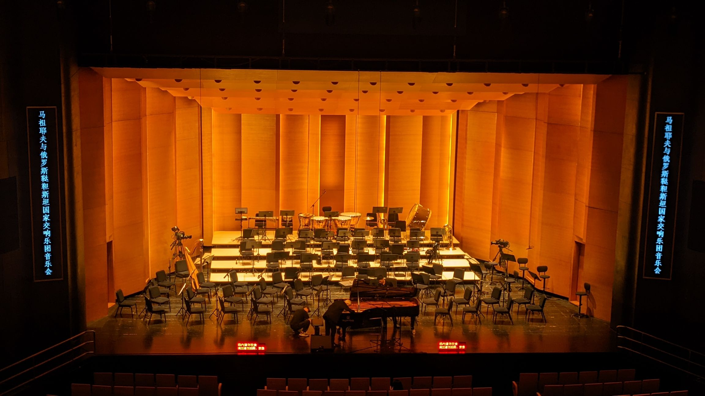
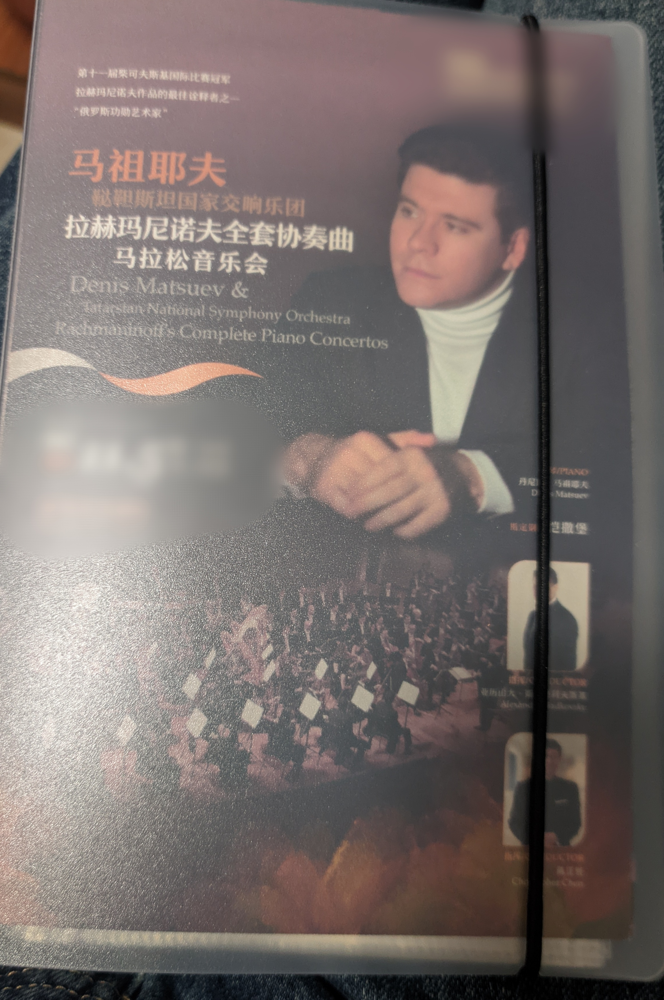
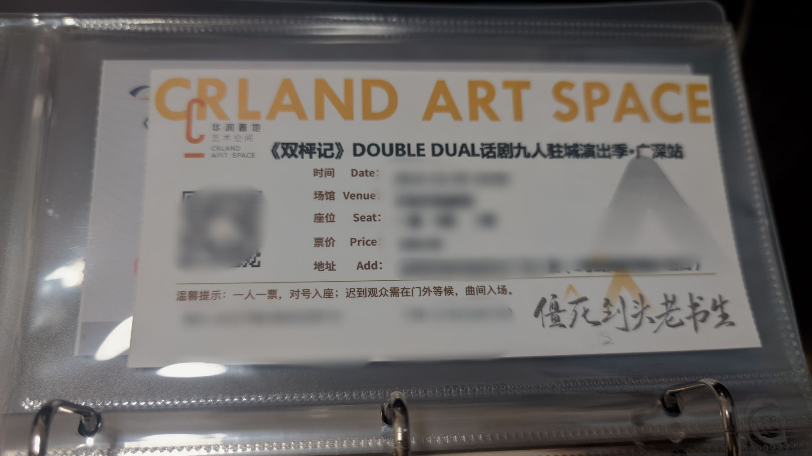
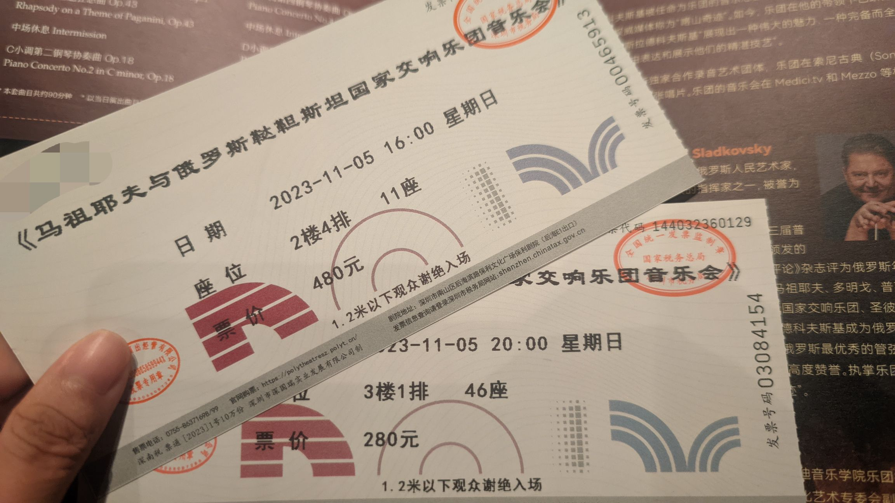
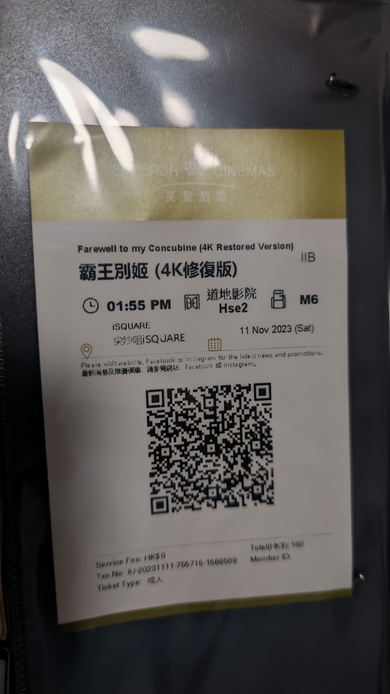









全年吃得最好的一个月，值得引入一个时间轴纪念一下。

标题是在说拉二，请听！



## 《双枰记》



第一次看九人的话剧，因为网络评价不错，期待还蛮高的。开票的时候咬咬牙买了380的票面，抢到了一张同价位最好的位置。当时还颇为自得，为自己买到了好位置开心了好一会儿。

看完后只想骂自己，好端端花这么多钱买这么前面干什么？

我真的不理解，如此单薄的剧本是如何在豆瓣获得高达8.9的评分的？看介绍原本以为只是人物有原型，结果实际一看，从故事到人物与原型的强关联性根本是在写同人；以为编剧起名字特地保留了原型的韵母是为了致敬，结果实际上根本就是同人女在起花名！编剧毫不吝啬地将高度浪漫化的品质寄托给陈独秀、胡适、章士钊这几个与政治高度关联的民国文人，将他们塑造成了几个仿佛生活在真空中的理想主义者。然而这当中两位在权力中心游走多年的文人政客，真能坦然说自己从前所作所为皆是遵从心中的理想道义吗？几个立场不同、早已分道扬镳的中年人，真能一夜之间因为几句辩论重归于好、冰释前嫌吗？

人物成了编剧抒发观点的工具，故事的逻辑在散播情怀的动机下随时可以舍弃。可如果真要听编剧借人物之口抛出的政治辩论与观点输出，只觉得是毫无新意的陈词滥调。剧本制造的笑点尴尬又过时，唯一听笑了的那一句“托洛茨基派与国民党取掎角之势以清共”，不过是拾了原型的牙慧。看到章士钊前一秒不满胡适用“跟了杜月笙”形容自己，下一秒因狱警拒绝将陈独秀送医时破口大骂：“我告诉你！杜老板杀的人不比你们蒋介石少！”的时候，我是真的气笑了，AO3上的同人文都不敢这么写。

再看两位市井女性角色。能够感受到编剧出于完善时空跨度加了这些戏份，但冯小寒这个角色从妆造到表演上都堪称失败。哪怕不提她令我感到冒犯的刻意的口音，在她自始至终宛如少女的表演、台词、妆造下，我直到谢幕也全然没有感受到她的人物在故事中有长达二十年的跨越。而大鼓女士在收到陌生人赠送的滚灯之后竟能保存二十年，就连逃难时刻也不忘从北京带到南京，莫名其妙的在偌大的南京城遇到滚灯制作者的后人还一见如故地聊了一下午，只为了在她们的对话中引出编剧引以为豪的金句。此等情节，我实在看不出编剧对剧情的基本逻辑有任何的尊重。

纵观整部话剧，台词是掉书袋的，人物是立不起来的，情节是缺乏深度推敲的。这样的剧本水平，即使在同人文里也只能算是没什么天分的高中生写的二流同人。哪怕我早就对高考状元的光环祛魅多年，看到一个北大毕业的编剧在三十岁的阅历支撑下，在打磨数年的商业演出拿出的竟然是如此不成熟的剧本，也觉得实在令人瞠目。或许写作真的是一件需要天赋的事情吧。

## 马祖耶夫与鞑靼斯坦国家交响乐团音乐会

传闻中的拉赫马拉松，据说上海场一票难求，每个价位都溢价了两百。本地这场是钢琴赞助商谈下来的临时加场，周五开票，周日开演。票面全场八折，到开演时还没有售空，文化荒漠有文化荒漠的好处。在闲鱼看见350出880价位的票没敢买，事后才得知赞助商拿了一大批赠票，结果那一片都没什么人来，后知后觉地感到可惜。

不同于上海场的 19:30-23:30 真·马拉松，这场其实更偏向于普通音乐会，分了 16:00 和 20:00 两场，分开售票。下午是拉一/帕狂/拉二，晚场是拉四/拉三。出于个人对帕狂和拉二的偏爱，我一开始只买了下午场。这时候票面还能挑一挑，选了二楼前排中间偏左的位置。

开篇的拉一我没听过（？），处在一种绝望的文盲的状态，基本就是：诶感觉这段旋律不错，然后开始观察后面的打击乐组。不过不熟悉的曲子放在开篇，也可以比较好的将人带入状态。

这之后是我非常喜欢的帕格尼尼主题狂想曲。帕格尼尼的《第二十四号随想曲》曾被多次改编，我最早听其中的某段旋律是在李斯特改编的帕格尼尼练习曲，第一次听就非常喜欢。拉赫的帕格尼尼主题狂想曲由二十四段变奏组成，在帕格尼尼主题下，某些变奏融入了中世纪圣咏《震怒之日》，听上去尤为阴森可怖；而这之后最为著名的第18变奏，在柔和浪漫的抒情之下，有着非常深刻的拉赫的俄式烙印。这首曲子哪怕不投入那么多理解，在旋律上也是非常动人的。

在听完帕狂之后我已经渐渐进入状态，虽然帕狂是技巧性的曲子，我尚未投入情感上的共鸣，但中场休息往外走的时候感觉自己的血管都在微微颤动。现场的听觉感受比流媒体播放强上太多了。

下半场是拉赫马尼诺夫第二钢协，我命运般的拉二。这首乐曲的创作背景无需多言：拉赫在早年拉一首演失败后陷入抑郁，数年之后，在心理医生的帮助下走了出来。在拉赫走出抑郁、重新拥有创作灵感之后，他心怀感激地将这首曲子献给了他的心理医生。

带着这样的背景，不难听出拉二的创作情绪。第一乐章开篇沉郁灰暗，情绪的起伏仿佛海水翻涌，如同晦暗的夜晚在风雨大作的深海孤独航行，表现了郁期时内心复杂激烈的涌动。钢琴与管弦乐的对抗，如同个人与命运的抗争，第一乐章的末尾逐渐转向抒情平和，而急速拉升的结尾如同在与命运的斗争中撕开了一个口子，于是天光乍破、冰川松动。第二乐章肃穆舒缓，在富有浪漫与幻想的柔和曲调下，如同温和的阳光照向波光粼粼的平静湖面，仿佛重新拥有了对生活中美好事物的感知，逐渐涌现光明和希望。第三乐章的华彩如同炽烈、跳动的火焰，能够感受到生命热切涌动的力量，包含着更为宏大深邃的情绪，是超脱困境之后的释然和喜悦。

我真的非常喜欢拉二，能听到拉二现场真的太好了……这种情感上的共鸣、心灵的震颤实在太过动人。离场的时候深感没听够，于是冲动之下买了晚场的票。

这个加场加的有点失败。客观来说晚场有着乐团主场指挥加持，乐团的表现相较于下午是更好的。然而一来我拉三拉四听得不多，而拉赫又是需要反复聆听才能喜欢上的，导致我对旋律并不够熟悉；二来我失眠，之前的连续两天都到早上五点才睡，晚间已经有点困了；最后就是临时加的位置实在挂壁的不行。三楼右侧后方，必须坐直才能看到乐团和演奏家，拉三的钢琴声甚至偶尔被铜管掩盖。这就导致虽然我知道旋律是好听的，却难以进入下午场共鸣的状态，下次还是不要再冲动加场了。

然后这个钢琴，是赞助商珠江的国产琴，本来我以为我是木头耳朵，分不出琴的好坏，结果晚上拉三铲煤的那段华彩的低音部分实在是糊得不像话……另外网评说乐团是二流乐团，配不上老马，不过我对交响的理解仅限于听个响，实在听不出好坏。

最后批判一下观众素质，我看网上说这场乐章间都没有人鼓掌，说明观众素质很高。我看不见得吧！我觉得乐章间不能鼓掌就是个牛排不能要八分熟的问题，拿见识的深浅鄙夷别人，实在没什么意思。有些人知道乐章间不能鼓掌，却连基本的礼貌都做不到：下午场边上的老太太素质还相对高点，但在拉二开始之后还企图聊天，被我制止；晚上我那边角座位更是离谱，坐我右边的情侣 buff 叠满，迟到之后乐章之间进场，来了之后时不时窃窃私语，等到拉三还美美盗摄一段，我真服了。

听完之后的感想就是，现场真的比线上听更能打动人，而且听完之后我久违地睡得特别好。虽然听完那天晚上睡的不算久，在前两天失眠的情况下当天睡了不到五个小时，但是醒来之后感觉得到了真正的休息，近几年仿佛永远被攥紧的大脑终于松弛了下来。如果说我这几年的精神状态一直像一个最高20%的电池，我觉得它在真的回到了100%。这让我确信，哪怕抛却审美和赏析，古典音乐仍然拥有治愈人精神的力量。
## 《霸王别姬》



霸王别姬30周年，4K修复版本环中国大陆重映。研究了一下香港影院的购票，发现还是好买的。

第一次尝试看是十岁出头，因为对后半的剧情全无印象，推测当初大概是没有看完。不过没看完也未必是坏事，把这部片子留给能够看懂这部片子的年纪，留给影院和大银幕，反而会成为更加珍贵的体验。

《霸王别姬》上映已有三十年，原本觉得对影片的分析，前人之述应当备矣。结果打开豆瓣的某个高赞影评，大谈“小癞子外强中干，怕挨打所以自杀了”、“段小楼划清界限是为了菊仙好，结果菊仙情感上承受不住自杀了”。点进主页一看，唉，男的。

既然已经看到这么离谱的理解，我实在忍不住说一点我自己的理解。

首先看电影一直被打上的“同性”标签，无论十几年前还是现在，我都不觉得这是一个有关取向的故事，而是始终觉得这是一个关于性别认同的故事。小豆子遭遇的三次“阉割”，众多影评已经分析得非常完备。而当张国荣的程蝶衣出现在大银幕上时，我才真正感受到了顾盼生辉能够用来形容什么样的人。戏服是寻常的美，然而真正吸引我的是男装程蝶衣，举手投足之间，实在拥有一种令人移不开目光的、夺目的美。

小癞子毫无疑问是旧社会戏班子内普通孩童悲惨遭遇的缩影：举目无亲，被送到下九流的戏班，自小经历毫无人道的体罚，练不好要挨毒打，逃也要挨毒打。比起“成角儿”，那样年纪的小孩平生最大的愿望不过是吃糖葫芦。与小豆子偷溜出去看到了名角的表演，几乎是迷茫的问：“他们怎么成的角儿啊？”自小就已无所希望的人生，在将偷溜出去带回来的糖葫芦塞满嘴之后，已经没有什么旁的愿望了。

再说段小楼。很多影评说段小楼作为普通人的英雄气概是被生活逐渐改变从而消失的，我不认同。段小楼是个彻头彻尾的假霸王，年少时敢虚张声势的逞英雄，也不过是草莽的、地痞无赖式的，等到经历生活捶打之后，更是无时无刻不在低头。小时候在戏院挨师父打，求饶求得最响；菊仙当着师父的面问蝶衣的六指怎么说，段小楼的掌掴比起维护蝶衣，完全是自觉处于上位时，对妻子的颐指气使；等到真到了批斗的场面，他出卖起蝶衣时何曾想过维护他一点。那把剑代表了什么，蝶衣懂，菊仙懂，但段小楼从来没有懂过。

批斗之前，菊仙与段小楼的对话就已经为段小楼的行为埋下伏笔了。那段批斗戏，段小楼的状态递进很明显，起初试图避重就轻，被指“你避重就轻！你不老实！”真的开始出卖蝶衣、融入批斗的环境后，他的语调可以说是已经起范了。他原本就是生性凉薄之人，在融入这样疯狂年代的情绪之下，还想得起什么保护？无非是将一切可能危害到自己的人通通踢开、可以挡在自己身前的人一律当作盾牌罢了。这里的“我跟她划清界限”，情绪与《1984》里温斯顿遭受折磨之后，条件反射下的“咬裘莉亚！”极为类似。

蝶衣从来不是什么品行高尚的完人，伊无疑是带着人所具有的最卑劣的情绪妒忌与憎恨菊仙的。但蝶衣早年骄矜，哪怕针锋相对，无非是夹杂讽刺、互相呛声，而直到文革时伊被段小楼出卖，崩溃之下也开始毫无体面的撕咬菊仙。我不认为蝶衣是为了伤害段小楼才疯狂揭发菊仙的，段小楼始终是幼时那个维护伊的师哥，蝶衣的恨从来只对准菊仙。然而真正害死菊仙的从来不是蝶衣的揭发，而是段小楼的：“真的不爱！真的，我真的不爱她。我跟她划清界限！我从此跟她划清界限了！”这就是她一生中用了所有勇敢、所有对政治局势的机敏保下的男人给她的答案，也是在此刻，她才真正对蝶衣一生的处境感同身受。

那段批斗戏看得我极为震惊和崩溃，在电影院时整个人几乎失语，眼泪就那样自己流下来，想拿口袋里的纸巾，发现连手和身体都因为这段剧情被震撼到近乎僵住不能动弹了。

看到菊仙上吊的那段整个人已经麻了，忘了是影院的版本没给这里的戏曲唱词配字幕，还是我这时候根本已经看不进字幕了。  后来去看了b站的版本：“听奶奶，讲革命，英勇悲壮。却原来，我是风里生来雨里长。”是样板戏京剧《红灯记》，是毫无政治敏感度的程蝶衣曾经在文艺座谈会上反对的。在这一刻，它和三十年前菊仙拍下一桌首饰铜板给自己赎身时，老鸨的“真他妈想当太太奶奶了你？做你娘的玻璃梦去吧！你当你出了这门把脸一抹洒，你还真成了良人啦？你当这世界上狼啊虎啊，就都不认得你啦？”一起，共同成为了菊仙的谶语。

然而虞姬只能死在戏里。

## Nintendo Live 2023 Hong Kong

上任天堂了！详见：[Nintendo Live 2023 Hong Kong](/p/nintendo-live-2023-hongkong)

## 一些日常

装修了博客！因为某天发现用 hugo 的用户十个里面有九个都在用 stack，感觉都快要成博客界的格子衬衫了，而我使用这个主题已经三个月，有点审美疲劳了。于是选了配色，换了字体，小改了一些地方，装修完就是现在这个样子了。

买了票夹！准备收纳一下自己做韭菜的记录。对外观没什么太大的要求（其实有看上的，但是太贵了所以作罢），买了个磨砂透明外壳的，不到三十，那么请看本月收集的部分票据和折页！

