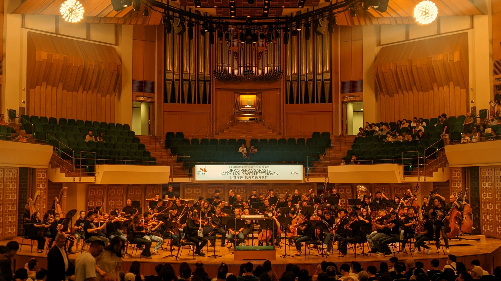
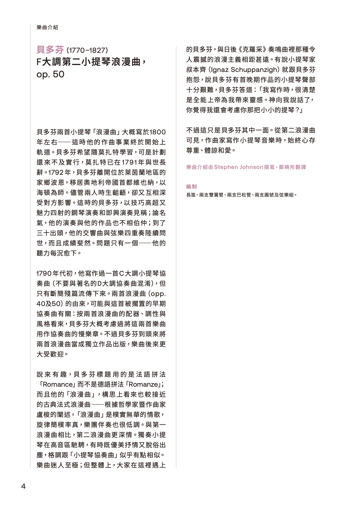
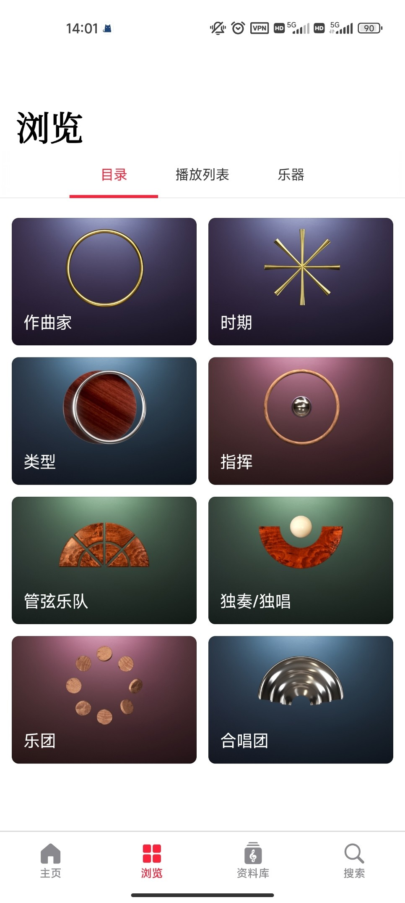
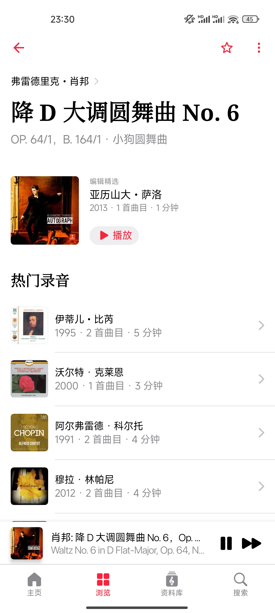
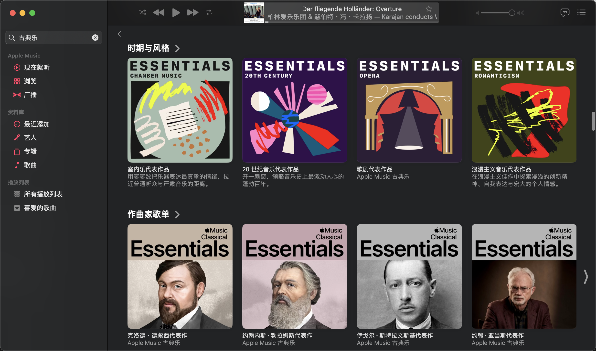

## COMICUP2024SP

终于去成了CPSP！有很多图，见：[COMICUP2024SP](/p/comicup2024sp)
## 《音乐影响了我的写作》



余华的书。很喜欢前半本的几篇文章。很多年以前看他的小说，《活着》文字里带着粗粝的土腥味，《细雨》是江南城镇里氤氲的水汽。但他的杂文文风如此平和，节奏是潮汐般的呼吸，传递的情绪却如同湖水一样沉静而平和。

一些书评因为宣称自己不懂古典音乐而给出了较低的评价，但我很喜欢这本书里提及古典乐的部分。他乐于讲述的古典乐与写作叙事手法的共通之处，比如《高潮》中将肖斯塔科维奇第七交响曲第一乐章与霍桑《红字》的类比：“在跌宕恢宏的篇章后面，短暂和安详的叙述将会出现更加有力的震撼。“我同样喜欢看他讲述的西音史部分，文字柔和生动，娓娓道来，胜过很多传记。他谈及勃拉姆斯在浪漫主义时代坚持古典，讲述肖氏在苏联一生的境遇，提及拉赫与朋友辩论过音乐是否包含色彩。在他的文字下，我得以感知作家的目光是如何理解音乐的。

## 香港管弦乐团：欢乐时光贝多芬

非常满意的一次演出！

第一次来香港文化中心。外部建筑像是很有年头了，但内部的大厅和音乐厅应该都重新装修过。喜欢这个音乐厅……装修的很漂亮，而且很小！第一次离乐团这么近，开心的。

入场发的场刊我也很喜欢，有很厚一本，而且把介绍的重心放在了曲目上。内容细到创作背景，作曲家的想法，贝三《英雄》甚至谈及了各个乐章的分析。文章也并不是教材般的晦涩，而是很能吸引人读下去。之前在内地的册子一般只会着重介绍演奏者，对于曲目则是略略带过或是完全不谈及。相较而言，我更希望看到曲目和作曲家相关的介绍。

第一首是BWV565，在管风琴曲目中应该算是相当出名，或许很多人都在影视或游戏中听到过这首曲子的改编。作为开篇的曲目，音乐厅甚至做了灯光调度的效果。开场的独奏全场灭灯，只留一束从正上方打下来的灯光聚焦到管风琴。直到乐团快要进入时，才把全场的灯光缓缓亮起来。这样的灯光效果让人开场的注意力都集中在了管风琴的演奏者。

第一次听现场的管风琴演奏。作为宗教乐器，她的音色给我的感觉是神圣与恐惧的叠加，音律从高而远的上方传来，处在暗室之内，一度怀疑置身教堂。低沉的长音令人慑服，而与乐团合奏的漫长的强音则让人头皮发麻。非常特殊的体验。

然后是贝多芬第二小提琴浪漫曲，是很好听的一首曲子。上个月在本市的大音乐厅听演出的时候，小提琴和大提琴的曲目因为距离和观众席的吵闹听不分明，让我觉得非常遗憾。但这次的效果则非常好，小厅的声音近而清晰，噪声也少了许多，即使偶有噪声，在离乐团近的情况下也不会盖过音乐。

首席哥的小提拉的非常好……小提琴是音色非常丰富的乐器，像揉弦、碎弓这些细节的处理，录音难免存在细节的缺失，但现场能够很好的感受到。

压轴的贝三《英雄》同样演绎的特别好。这场的三把圆号特别稳！让我印象最深的是第三乐章圆号与一提部的呼应。我一直觉得交响是只有在现场才能完全感受的音乐类型，比如贝三中的一处，录音中只能隐约确认是拨弦，而在现场则可以看到整个一提部都在横放小提琴拨奏，是非常动人的音色。

可惜第二乐章的末尾还是被正后方的人的咳嗽打断了沉浸。然后我就开始观察乐团，一看发现右边的人穿的原来全是深色牛仔裤呀，再一看小提的第三副首席姐姐穿的还是浅色的破洞裤www然后又一看，穿的原来还是统一的黑色T恤文化衫。回去之后一查，下午场的 Happy Hour 定位是没有那么正式的音乐会。我倒是完全不介意乐团穿的是不是正装，第一次看不是正装的演出，感觉还挺新鲜的。

这次真的听得很满足。好像以前听音乐会总觉得正餐部分不够完美（不一定是乐团方面，可能是观众方面的问题），想在安可的时候弥补一下遗憾。这次之后忽然意识到好的演出其实完全不需要安可，真好啊。

## Apple Music (Classical?) 试用体验

吃上好的之后感觉最近几个月都可以不用去音乐厅了，于是研究了一下古典音乐流媒体，准备系统的聆听一下。

市面上主要的音乐流媒体都是基于流行乐开发的。流行乐只有单曲，专辑则是若干个不相关的单曲的集合，不适合古典乐的多乐章。在国内流媒体收割流行乐版权的同时，想找到较高音质的古典乐则很难。另一个痛点是搜索功能的残缺，中英文无法对应，想要搜索必须打对曲子的英文全名。

简单试用了一下，发现软件逻辑非常友好。有分门别类的探索页，还以曲目为索引归类了各版本。搜索曲目时，不需要打一长串的 Symphony No. 3 in E-Flat Major, Op. 55 "Eroica"，而是搜“贝多芬第三交响曲”就能获得结果。缺点是：只有手机端。

那么电脑端的呢？试试 Apple Music 吧。没有 Apple Music Classical 那么纯享，但古典乐专区也足够使用：歌单共通，搜索功能也与 Classical 一样丝滑。如果要说唯一的缺点，大概就是 Classical 只有古典乐，而 Apple Music 的最上方的推荐歌单中会夹杂一些流行纯音乐。

软件给我最大的感觉是简洁和干净，我受够了国内音乐软件不断做加法的产品逻辑了，而这份简洁令我感到舒适。而且很便宜！Apple Music 和 Apple Music Classical 的会员是共通的，只要11元/月，我觉得非常的好。