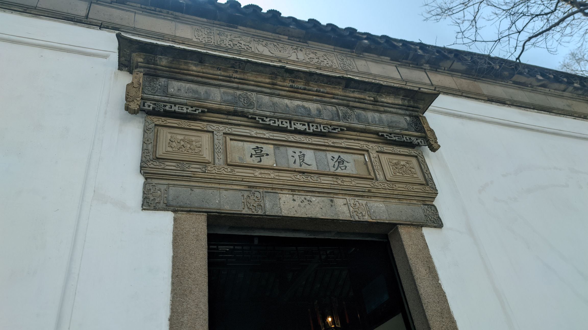
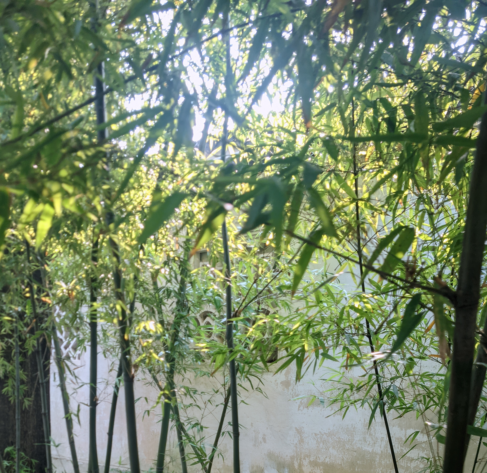
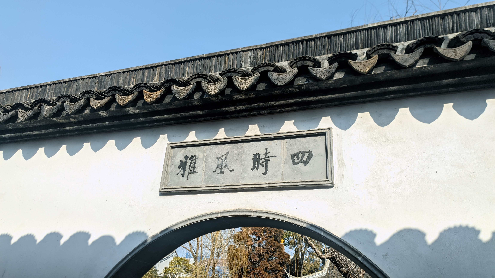

## 苏州行记

### 沧浪独步

沧浪亭借水成景，渡桥入园，开门见山，亭飞临于连绵假山，隐于林木，踏石拾级而上，登临可俯瞰全园。依山造景时，多处叠石为洞，石屋清凉，方寸之内，另有天地。

我来时是冬日，草木摇落，假山四周原本是苍郁的古树，此时仰望，只见枯枝。无缘见高林翠阜，乔木苍烟。好在梅花凌寒，松竹长青，因而晴日朗照时，仍见亮色。



我特别喜欢竹子！不是喜欢竹子被文人赋予的意象，就是觉得竹子完全符合我内心的审美，只是见到就觉得安心与享受。但我已经有很多年没有看见竹子了。而沧浪亭前水后竹，竹木环生，品种各异，似无穷极。苏舜钦在《沧浪亭怀贯之》写“日光穿竹翠玲珑”，我也有幸得见。

 

### 四时风雅

来之前做攻略，得知可园和沧浪亭离得很近，可以一起逛，遂买票。真到了一看，这也太近了！

沧浪亭与可园沿溪相望，越过曲桥，便是可园。看入园处的介绍得知，可园的可，是“沧浪之水清兮，可以濯吾缨”的可。感觉这个名字起的，有点随便啊……

可园在清代时被划为书院，比起沧浪亭如登山林的游览体验，可园在设计上显得中正疏朗。我最喜欢的景，是从月洞门向内望，可见水木明瑟，亭宇落于正中。步至堂前，回望曲槛临水，枯柳悬垂，几无生机。四时风雅，此为冬景。

### 游园不值

游园不值，不是这样用的。但是这个留园，去得真的不太值。

我安排行程时，有意避开人潮。上午去沧浪亭，下了地铁后，宽阔的道路偶有三两行人。园内人不算多，气氛松弛；除游客外，有闲坐对谈的老人，有抓拍晴日风景的摄影爱好者。计划下午前往大型园子，本以为避开拙政园就没事，没想到留园也是重量级。

园林一旦人多，便失意趣；但我去之前也未曾想，人竟能多到此等恐怖的地步。从地铁站一路过去，车水马龙，游人如织；走至正门之外，只见队伍环回，缓缓前移。

留园的入口原本欲做障景的设计：进门是狭长的暗室，在夹道内蜿蜒徐行，景致三收三放，历经明暗交迭，直至步入园林，豁然开朗，方知别有洞天。

那么在此等密集的人流下，呈现的是什么景象呢？是你进了一个窄门，步入暗室，夹道狭窄昏黑，顶上挂着散发暗红幽光的六角灯笼，欲疾行而不得，欲退却亦不得，只能跟随人潮缓缓蠕动。这场景改一改就是中式恐怖游戏。

进了园林，折磨还没有结束，还要走狭窄的回廊、曲折的假山、仅容一两人通行的水间石路。园林前长廊的六扇漏窗设计之初是为隐见山水，可即使是不见游人的漏窗，透过其望见的水上回廊竟因过年挂上了中国结！原本假山抱水，林木森郁，为的是雅致清幽，你用密集的大红点缀，能好看吗？

眼见这般景象，我们即使一进门就想走了，找出口也仍然用了半天。另外留园的景区开发与商业化很严重，除了常规的讲解器出租，有一处二层建筑做成茶室卖茶，出口更是设有 VR 游览体验馆。我人都在这里了，你给我看 VR，何意啊？

### 齿间春秋

只是在安排行程时在小红书刷到了网红评弹馆。阅览评价之后，得知演出内容有半数是吴语流行歌曲。我思来想去，觉得和家人出行还是要在项目安排上做一些迁就的。如果我独自出行，行程中必去博物馆。但我知道我妈对这种东西不太感兴趣，所以此行没有强烈的前往苏博的愿望，最后更是直接没约到票。我妈业余学了很多年美声，感觉这种偏网红的评弹馆，比起传统评弹馆或许会更符合她喜好。

提前买了前排的票，进门一看新开的店环境挺好的，沙发看着很高级，还很软，还有茶喝。其实我更是门外汉，虽然不爱听流行吴语歌曲，但真让我纯听传统评弹，估计我也听不下去。听了之后感觉其实还不错，这种半介绍科普半演出的方式对我来说其实挺合适的。值得一提的是网络平台上之前提到的一些避雷点都有改善，因此给人观感还可以。也算是有在迭代改善，做生意就要这样做嘛。

吴语十里不同音，让我听苏州评弹，不看字幕几乎听不懂。也学到了一些新知识，比如评弹用的是文读的中州韵，不是苏州方言口语。像“姐姐”在文读与口语中差异很大，而文读的念法除了音调外，倒是和我老家的念法一致；再如戏文中的“娘子”，对应的口语是听觉与含义都不算雅的“家主婆”。

早告诉你们了，吴侬软语都是骗人的。

快结束的时候提到，评弹的曲目多是悲剧，但是大过年的，不能让大家听悲的。于是演了《白蛇传·赏中秋》，开头唱：“七里山塘景物新，秋高气爽净无尘。今日里是欣逢佳节同游赏，半日偷闲酒一樽。”

我就以此作题吧。

## 《看不见的女性》

抱歉，只看了50%……但还是写一写。

我在女权主义上一直认同波伏娃的：“女人不是天生的，而是被塑造的。”即女性只有冲破社会性别的建构与定义，才能重获身为人的自由。那么这本书很大程度将我曾经忽视的一系列现实置于我眼前：即当前我们作为女性的处境，究竟有多少来自于生理性别，多少来自社会性别？

坦白说，这本书只是引言部分就足够振聋发聩，因为事实的说服力远胜于观点。即各种看似“性别中立”的设计，其实都处于第一性的阴影之下。

书里提到，女性遭遇车祸受轻伤的可能性比男性高71%，重伤可能性高47%，死亡率高17%——因为汽车根据男性身材设计，碰撞测试假人几十年来都以男性为基准，即使近年采用女性假人测试，也未考虑女性的肌肉质量分布与骨密度等生理差异；相当多的药物实验未将女性纳入研究，90%的药理学论文只描述雄性动物的研究，这可能导致同样的药物，女性服用后效果远不如男性。

我问自己，打破刻板印象能够有助于我们不再在女厕排满无休止的长队吗？能够让我们不再来月经吗？能够让我的身体成为一具一般男性的身体，适应那些所有人都需要使用，但却只以男性为基准设计的产品吗？

读这本书似乎只需要等待共鸣，因为作为女性，你必然、一定、无疑经历过其中某些类似的处境。书中提到钢琴的宽度、手机的大小都是以男性为标准设计，前者导致大手演奏者的演奏机能更佳，后者提到如今不断变大的手机令许多成年女性无法单手握持——但好在它不会继续变大，因为这样普通男性就也拿不住了。我的手应该算小，即使成年之后也只够到钢琴的八度；我想起我初次购入 Switch Pro 手柄之后，我的右手大拇指曾经因为操纵右摇杆感受到拉长的抻痛，直到一段时间后，我终于“适应”了这个手柄。于是我又想起我工位上的人体工学椅，它的靠枕永远只能抵着我的后脑勺，我想我应该是没机会适应它了，因为我没法长高了。

书里提到VR导致女性出现头晕症状的程度远超男性，因为男性明显更有可能依赖“运动视差”来确定深度感知，女性则更依赖“阴影形状”，VR在前者上做得很好，而在后者上做得很糟糕。读到这里我也在联想，我的普通游戏晕3D症状会与此有关吗？

书中还提到了很多我们或许此生无法经历的事实：比如第三世界的女性处境，公交车站、公共厕所的位置选择，关乎她们面临强奸案的可能性大小；比如女性承担了75%的无偿照护工作，这令她们每日的行程更为琐碎，有别于只需两点一线通勤上班的男性——而城市的公共交通是以后者为基础设计的。

无论如何，正视已有的现实，是我们应该踏出的第一步。