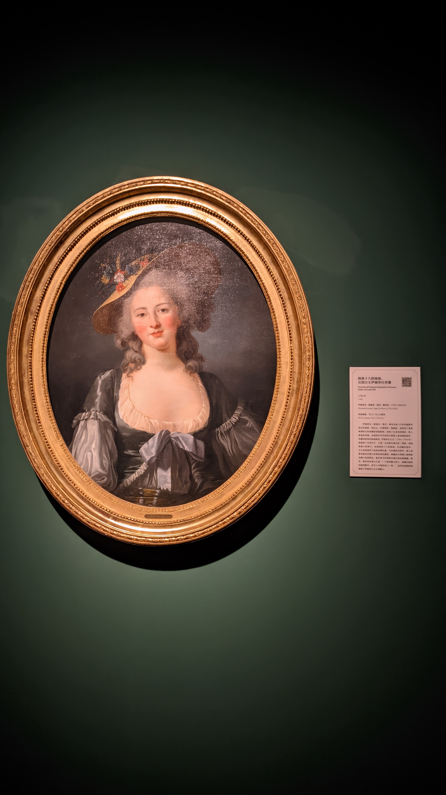
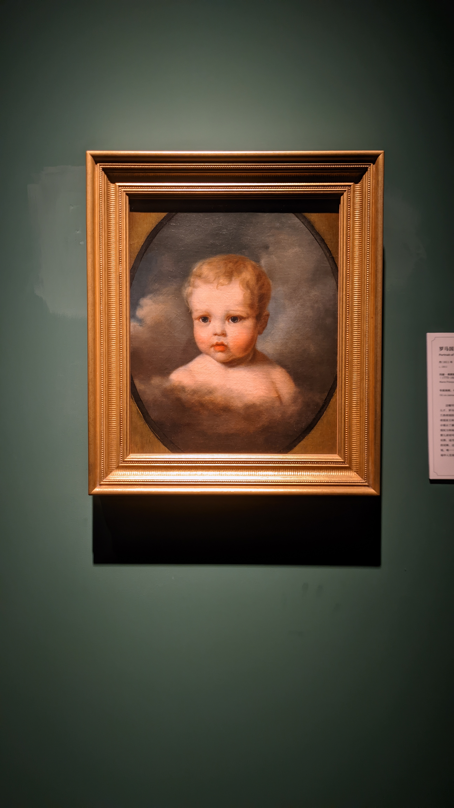
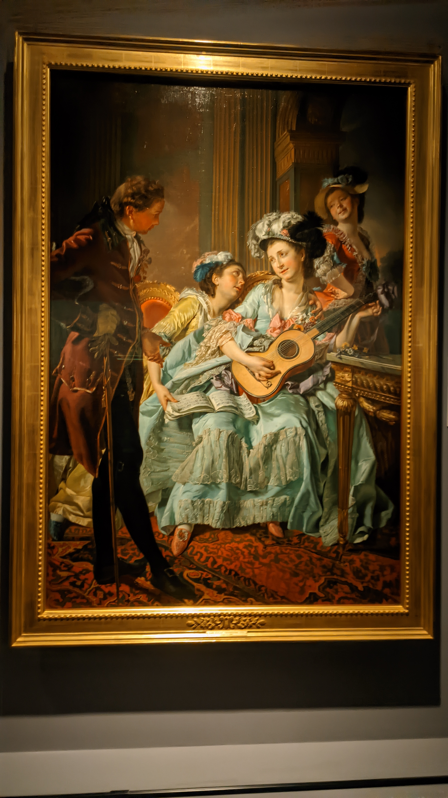
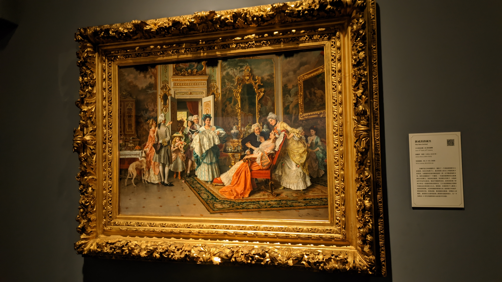
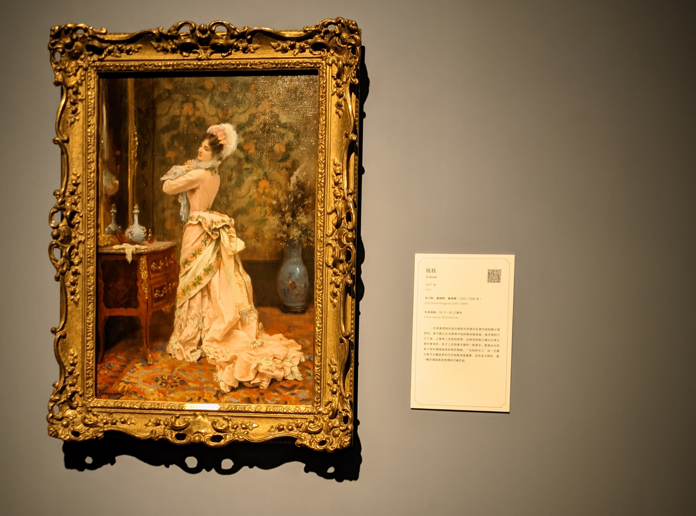
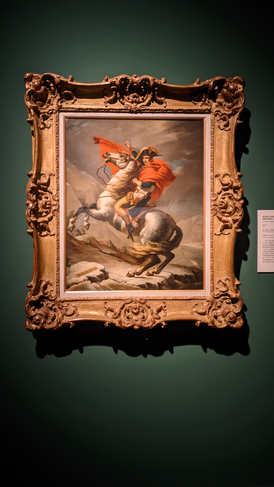

## 诡秘之主

抱歉，原本在我的计划里，博客的月记部分应该不会出现网文。因为我原本是想借此逼自己读一点严肃书籍的！但是，但是，是这样的呀，我想了很久都没有想出标题，于是去翻博尔赫斯，翻到了标题的这篇，感觉代到了很多。以至于我必须写一写诡秘之主，才能讲述我引用它的理由。

说回我的一月吧，整个一月完全就是在看诡秘之主。我对大长篇网文始终抱有恐惧，因为长篇小说本身考验作者功力，而网文的日更要求，对作者可以称得上是一种写作上的压榨。技法不够成熟的作者容易因此抛却很多，比如人物的塑造、情节的把控、乃至写作的技巧。你将不可避免的看到某一本开篇无比吸引你的小说在几百个章节的磨损后已经面目全非。

因此哪怕我久闻诡秘大名，但在怀揣这种恐惧的前提下，始终没有勇气开始阅读。转折是我年底刚刚通关完血源，急于寻找代餐，而诡秘的写作是确凿无疑的受到了血源的影响的。另一个原因就是，日历翻了一页，新年嘛，就适合做一些需要做心理建设才能决定做的事。

继上次被开头劝退之后重读，察觉一旦把对这本书的预期调整成普通水平的起点网文，会意外的发现写得还挺好的……虽然它仍然拥有一些网文写作的毛病，比如段落偏短，一句一换行，有时候会出现一句话说两遍等疑似水字数的行为，但我能够将其理解为网文更新要求下的牺牲——在每天要产出几千上万字的前提下，不需要推敲上下文的短段落对作者而言是一种更节能的行为，对看网文作消遣的读者也更友好。而剔除这些后，诡秘在写作上拥有凝练、精确的修辞，拥有能够令人迅速记住特点的人物塑造，是克制但生动的白描。更进一步的，第一卷在情节架构上的把握，伏笔的安排与收束，乃至某些关键剧情中如同洪流一般的叙事推进与之带来的情感递进，更是让我看出了作者在写作上的野心。

升级流网文在让读者“爽”这方面有很多近乎模板化的技巧，能够让其更趋于商业上的成功。但诡秘一定程度上抛却了这些，在较为成熟的笔法下，将一定的人文关怀与悲悯作为故事的底色。相较而言，这是一条更困难的路。但正是这样的故事在某些时刻打动了我，这也是我在月记中给诡秘留有位置的真正原因。因为这个博客存在的全部意义，就是想记录被任何作品打动的瞬间。

截止到写这篇文章时，我离看完诡秘还差大约一百多章，但我最爱的无疑是第一卷。尽管乌贼作为拥有成熟剧情把控能力的老作者，能够把这连载的大长篇总体控制在佳作以上的水平，但唯独前期给我带来了最大的惊艳感。正如第一卷总结中所提到的，他有意识的将第一卷以中短篇写作的形式进行伏笔埋线和布线构思，这使整卷的结构显得极为精巧。在开篇，给读者提供了徐徐展开的维多利亚时代背景，蒸汽朋克城市风貌，尚未显露全貌的非凡世界观设定和基于此的战斗设计，以及最重要的，寥寥数笔就已经跃然纸上的、足够生动的人物刻画。

哪怕我已经看到小说的末尾，透过那个足够老练、强大、仿佛游刃有余的身影，也仍然会看到最初那个缺乏战斗经验、被队长与前辈指引的克莱恩·莫雷蒂；正如我想起这本小说，最先浮现在脑海中的画面永远是绯红月色与典雅煤气灯交相辉映着凸肚窗的廷根夜色，佐特兰街尚未倾颓的黑荆棘安保公司，或是克莱恩与兄长和妹妹三人共进晚餐、享用豌豆炖羔羊肉与香煎肉鱼的傍晚。

我已经太久没有为一部小说流泪。读到这首诗时，我仍然会想起廷根市值夜小队，想起不见经传的、对抗危险与疯狂的守护者。

我想把这首诗遥寄给他们。


你世上的日子编织了欢乐痛苦，  
对你来说是整个宇宙，  
它们的回忆如今在何处？  
它们已在岁月的河流中消失； 
你只是目录里的一个条目。   
神给了别人无穷的荣誉，  
铭文、铸文、纪念碑和历史记载，  
至于你，不见经传的朋友， 
我们只知道你在一个黄昏听过夜莺。 
在昏暗的长春花间， 
你模糊的影子也许会想神对你未免吝啬。   
日子是一张琐碎小事织成的网，  
遗忘是由灰烬构成，  
难道还有更好的命运？   
神在别人头上投下荣誊的光芒，  
无情的荣光审视着深处，数着裂罅，  
最终将揉碎它所推崇的玫瑰；  
对你还是比较慈悲，我的兄弟。  
你在一个不会成为黑夜的黄昏陶醉，  
听着忒奥克里托斯的夜莺歌唱。


## 超级马里奥：惊奇

在 [Nintendo Live HK](/p/nintendo-live-2023-hongkong) 试玩惊奇之后，我许下了一个有机会一定买来玩的承诺，在数月之后终于达成。

我并不算是忠实的马里奥系列玩家，这是我的第三部马里奥，第二部2D马。在此之前我玩过《超级马里奥：奥德赛》和《马里奥制造2》，虽然奥德赛创意与设计让我能客观感受到它是一部佳作，但诚实的说，它并不算对我的胃口；而马造2以“制造”为名，集成了之前三种2D马的整体设计，主要卖点是海量的玩家设计图，难度有余，灵感和创意却不足。怀着上述印象，在第一次从任天堂直面会看到惊奇的首个宣传片时，我并没有什么特别的感觉。

那么，是什么改变了我对惊奇的态度呢？是它从宣传片里体现出的吃了云南菌子般的精神状态吗？

不是，是闲聊小花。

惊奇发售后，我看了很多小花视频，小花真的太可爱了。因此在 Live 现场试玩，确认了前代那个很滑的手感有所改善之后，我就把惊奇放入了我的待玩清单。在通关空洞骑士之后，我发现我的2D平台跳跃游戏的水平确实拥有了很大的提升，这使我不再对惊奇的难度抱有畏惧。今日之我已非昨日之我！

我全程都用的桃花公主，一是有可选的女性角色时我会尽量使用女性角色，二是桃花公主在马里奥大电影里优秀的平台跳跃能力给我留下了非常深刻的印象，能让我仿佛获得一些加持。所以惊奇在我手上就成了一个公主打败魔王拯救世界的故事。至于马里奥？好像是个只出现了两次的路人。

而游玩下来最惊艳我的点有两个，一是极致的创意，二是充分体现善意的联机设计。

我在游玩前对惊奇的印象除了小花，就是网络流传甚广的1-3《吞食花进行曲》。而在游玩过程中，我无数次体会到了观看《吞食花进行曲》那一刻的惊艳。

《惊奇》是一部全新的2D马里奥！这也就意味着这部游戏在关卡的组成上引入了足够多的新元素作为原子，而惊奇种子的存在，让这些元素形成了足够新奇的化学反应。任天堂的某位前员工将任天堂形容为“天才们的天堂，普通人的地狱”，而我在游玩过程中无数次感叹，这些天才仿佛永不穷尽的创想，以及将想法化为真实的能力，让他们真正成为了这个2D世界的造物主。

前代作品马造因其对抗性被称为闸种大乱斗，而惊奇的联机则是另一个世界，它抹去了一切对抗，只留下了互助。其他玩家将作为实时的虚影与你共处同一关卡，某些行为可以增加玩家的友善点数：包括将他们的存在作为复活点，向同一关卡的玩家发送道具，以及一同摸旗杆通过终点。

这样的设计使这个游戏成为了一个近乎乌托邦的世界。在我还不熟悉联机模式时，就收下了一个蓝色耀西发出的状态气球——它放出气球，站在岸边，等待水中的我；在两个本应该极度恶心的广场隐藏砖关卡，分别有一个蓝色奇诺比奥和一个黄色奇诺比奥一点点带领我收集完了所有隐藏要素；而在特殊世界的隐藏关花花群岛SP，我与一个马里奥和一个耀西一路合作，在出错即死的困难关卡无数次互相充当对方的复活点，最后一起走到终点，摸到了旗子，在终点一起发送笑脸。

这是一个善意被鼓励的世界，每一个打开联机模式的玩家都能够拥有相似却独特的感触。

通关之后我又在感叹，在这个游戏体验高度同质化的市场，只有任天堂还在把你当小孩。他们给予玩家仿佛独属孩童的无限创意，以及一个所有善意都能够被发送、被回馈的世界。

## 对望与凝视：东京富士美术馆藏西方人物画展

我必须诚实的说，我不懂什么艺术，也不懂什么美术史。博物馆有两个特展，我原本是去看万历展的，不过看完之后感觉还是这个展好看一些。别问我好看在哪，问就是我又拿去代了。

著名的《跨过阿尔卑斯山圣伯纳隘道的拿破仑》。附赠博物馆至暗时刻：“拿破仑是俄罗斯人吗？”
## 邓泰山钢琴独奏会

开篇是福雷的《降e小调夜曲 Op.33 No.1》和《a小调船歌 Op.26 No.1》，这两首曲子本身旋律就优雅绵长，船歌给我的感觉如同珠玉落进流水。

之后是德彪西的两首阿拉伯风格舞曲和五首《意象集》选曲。我十二三岁听德彪西的时候以为我这辈子都理解不了印象派，觉得其中的和弦完全就是不协和音，但现在似乎能理解一些其中的独特之处了。和古典乐相比仿佛是某种画笔在勾勒光影，用音符来具象化各种事物。

下半场是肖邦，我很喜欢他对肖邦的自由且富有歌唱性的演绎和不太强调颗粒感的诠释。随着曲目情绪的递进，压轴的《英雄波兰舞曲》极富辉煌，能感受并与演奏者的情绪产生共鸣。

有两首安可曲目，肖邦的《降A大调圆舞曲 Op.34 No.2》和德彪西《木偶步态舞》，这首圆舞曲我真的很喜欢。虽然整场都是小品曲目，但能听肖邦真的很满足。
## 掉落日常

正如前文说的，新年就适合下定决心做一些一直在犹豫要不要去做的事，所以从1.1开始，我在嚷嚷了无数次我怎么不会画画之后决定从零开始学画画。

虽然我经常偷懒，但还是勉强完成了 KK 幼儿园第一个月的线条练习，之后会开始抓型练习。坦白说我其实也并不急功近利，毕竟这些练习对我来说好像是下班后抄新时代佛经，还能放松一下脑子。但有时候还是想感叹一下，我要什么时候才能画出可以看的东西呢。