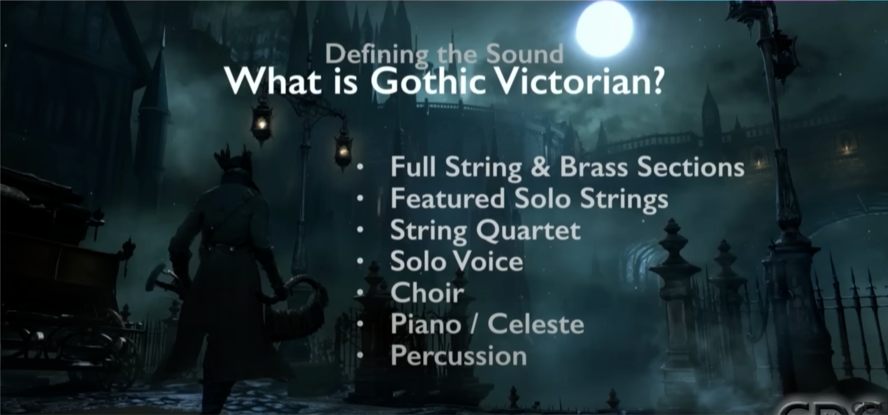
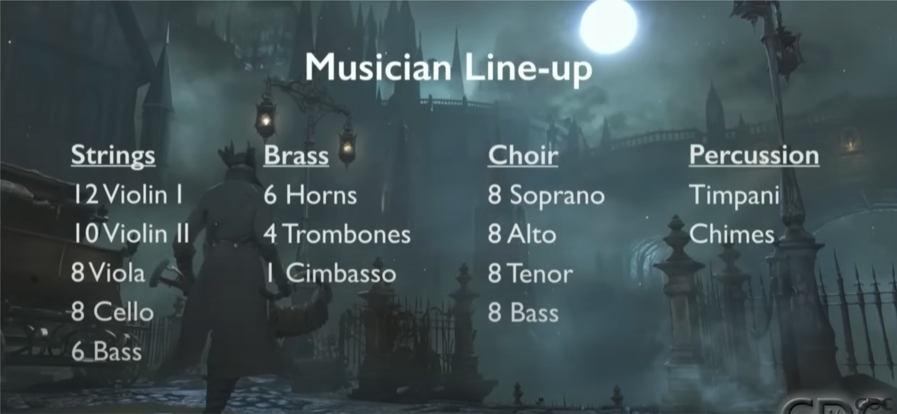

## 血源诅咒：古老猎人


"...Please, bring to an end the horror...  
 
...So our forefathers sinned?  
 
...We hunters cannot bear their weight forever...  
 
...It isn't fair, it just isn't fair..."
 

### 关于故事 

我一直认为《血源诅咒》在克苏鲁恐惧上，无论是叙事手法还是氛围渲染都相当出色。在洛夫克拉夫特式恐怖关于未知宇宙的常见意象中，血源本篇涉及了天空、地底与梦境，而古老猎人篇则补上了拼图的最后一环——深海。

血源的故事始终贯穿了人类对未知的狂热与恐惧，而当对知识与进化的热切渴求压倒了人性，人失去了同情与敬畏，实际上是人变为了野兽。这也使古老猎人篇的故事成为了本篇中威廉大师话语的注脚：“可耻的进化会招致人类的堕落。”

### 也想谈及音乐

血源的音乐团队在 GDC 演讲：[The Gothic Horror Music of Bloodborne](https://www.youtube.com/watch?v=5yncMReF8QA&themeRefresh=1) 中陈述了他们的一些创作理念。他们根据“维多利亚时代的哥特式恐怖基调”确定了乐曲的配器，根据作曲家们总结的时代印象（比如维多利亚时代流行弦乐独奏与弦乐四重奏），归纳了在作曲时使用到的管弦乐团编制，使多名作曲家的创作拥有相对统一的风格。

演讲中也提及音乐团队在创作时采用了20世纪现代主义、表现主义音乐的特性，来表现洛夫克拉夫特式恐怖；用丰富、不和谐、强烈且高潮迭起的音乐，来渲染与野兽或上位者的战斗。

以下是我的猜测：《血源》在塑造古老猎人的时代时，在许多设计的原型上都采用了中世纪的事物——研究大厅的开颅手术、疑似源于中世纪刑具的猎人工具、路德维希的“圣剑与骑士”等相关意象，都在暗示古老猎人所处的时代与现代亚楠维多利亚时代存在区分。而在DLC音乐的创作上，我觉得作曲团队似乎也有意识与现代主义音乐做出差分，使其表现更像是浪漫主义时代的古典音乐。比如路德维希二阶段的华尔兹，玛利亚一阶段的弦乐二重奏。

在血源的音乐中，我最喜欢的几首BOSS战配乐均出自斋藤司之手，分别是神职人员野兽、格曼、劳伦斯的配乐。在DLC的音乐中，我想详细讲述一下我对劳伦斯配乐的个人理解。



首先看曲子的调性。这是一首升C小调的乐曲。不同作曲家对调性所包含情感的理解不尽相同，一些理解认为，升C小调包含痛苦的呻吟，与绝望的哀叹、压倒性的悲伤与忏悔有关；克里斯汀·舒巴特在《声音艺术的美学理念》中认为，升C小调是“对神或挚友悲伤的忏悔、亲密的对话；对友情或爱情失望的叹息”。

再看配器。劳伦斯的音乐是血源中唯一使用了管风琴的配乐。管风琴作为宗教乐器，符合人物的主教身份。此外我一直认为管风琴的音色除神圣外，在小调音乐的表现上还有威严与恐惧的叠加，其实很符合《血源》治愈教会的风格。管风琴的长音在现场演奏中令人头皮发麻，而这首曲子也的确在管风琴的编排上使用了大量的长音。但或许是收音的原因，乐曲中管风琴的音量显得有些遥远和微弱。

乐曲中非常明显的出现了本篇中[《神职人员野兽》](https://music.163.com/#/song?id=31284158)的动机和变奏。血源的很多音乐都包含了拉丁语的合唱，几乎可以认为是系列配乐的音乐签名。《神职人员野兽》赞颂圣血的古典合唱让我联想到宗教氛围浓厚的弥撒曲，而音乐动机的情绪则暗含恐惧和不安。

劳伦斯的配乐中为什么会出现《神职人员野兽》的动机与变奏？答案在劳伦斯的头骨描述中：

> **劳伦斯的头骨**：治愈教会第一任主教劳伦斯的头骨。事实上，他成为了第一位神职人员野兽。而他身为人类的头骨只存在于噩梦之中。这具头骨象征他过去的、最后未能遵守的誓言。因此他要寻找它，即使记忆永远不会复还。

本篇击败主教阿梅利亚后，猎人触碰了大教堂祭坛上劳伦斯兽化的头骨，从而看见了劳伦斯曾经在威廉大师处立下的誓言：“敬畏古神之血”。未能遵守誓言的劳伦斯最后染上兽化病，成为了第一位神职人员野兽，这也是配乐与《神职人员野兽》具有关联的原因。

基于以上信息，做一下音乐的分段拆解，前三分钟的旋律均为《神职人员野兽》的主题变奏，动机均为《神职人员野兽》的音乐动机：

- 00:00-00:50：主体是合唱团的拉丁语吟唱，背景中始终有管风琴的长音，后半段加入了弦乐演奏的动机
- 00:50-01:26：管风琴独奏，后半段弦乐再度加入动机
- 01:26-02:08：合唱团开始第二段主题旋律的吟唱，后半段加入铜管，弦乐演奏的动机始终贯穿其间
- 02:08-03:03：合唱团始终演唱D#的单音，前半段背景为管风琴的长音与大提琴的短音（均为单音）；后半段小提琴反复演奏一个分解和弦，与上行级进的管乐一起引出一个转调

需要注意的是，弦乐部在前三分钟除了演奏动机外，小提琴与大提琴也同样演奏了一些紧张的、不安的短音或旋律。那么中提琴呢？中提琴在完成转调后的03:03开始了一段独奏。这是一段B大调的独奏，也是整首曲子中我最喜欢的一段旋律。血源音乐团队的GDC演讲中，提到他们会在一些曲子中（如《猎人的梦境》）使用中提琴来表达压抑的情感。而在这首曲子中，我认为中提琴代表了劳伦斯的内心独白。

无论是本篇还是DLC中，玩家都未能与劳伦斯直接对话。曾经的主教似乎像一个不顾一切的狂信徒：为了知识不顾一切，背弃了誓言，对圣血的滥用最终导致了兽灾的蔓延。我们似乎无从触及他内心的想法，他是否有过挣扎、有过恐惧？这一切的答案暗含在了音乐之中。

《神职人员野兽》的歌词是对圣血的纯粹礼赞，然而劳伦斯主题曲歌词则明确点出：“人皆因警惕圣血”、“血是亵渎之源的甘露”、“若你窥视这秘密，野兽便会窥视你”，然而结尾则是“深入探寻那秘密，即使只能依赖那圣血”——对未知的渴求战胜了恐惧，随后招致了毁灭。

回到这段中提琴独奏。前半段中，背景中始终包含着管风琴的长音，而后半段则被《神职人员野兽》的动机所代替。或许管风琴象征着信仰与敬畏，而这份敬畏最终被狂热的渴求所替代，引出了野兽的预兆。而此后澎湃的、将乐曲推至高潮的铜管与合唱，我认为象征了汹涌而来的命运。

在管乐重复这一段旋律后，乐曲回到升C小调，重复《神职人员野兽》动机直到结束——成为野兽，这就是最初的主教劳伦斯的结局。

## 迷宫饭



观看心情在“九井老师是神”和“扳机社懂个锤子迷宫饭”之间反复横跳。有些推荐会说前期主要在做饭，等后期推主线就好看了。可是我喜欢看做饭呀，我最喜欢看做饭了！

看迷宫饭总是很轻松，因为真的会被逗笑。九井老师，特别会塑造人物，特别会设定世界观，特别会写故事。作品的细节设定很详尽，有时候还会意外被弹幕科普一些DND相关知识，非常有趣。

特别喜欢解释迷宫生态和怪物生存机制时候的那股醍醐味。一般来说，类似题材的作品在做设定的时候都是天马行空，毕竟魔法就是幻想的产物！但迷宫饭就给你解释生蚝如何在铠甲内部形成聚落、如何操控铠甲。再比如魔法世界里龙会喷火天经地义，但迷宫饭就解释龙肚子里存了燃料，牙齿是打火石。就像是拆开复杂机器的外壳之后，看见里面的齿轮严丝合缝的运转。

没有迷宫饭看，身上像有蚂蚁在爬。或许会去补漫画吧。

## 排球少年：垃圾场之战



坏消息：粉丝向电影；好消息：我是粉丝。

说是粉丝，其实我也就是看过前几季的观众吧！大概也就是挺喜欢原作的水准，但没有看过同人，因为古馆春一配得太平了，缺乏搞同人的欲望。

之前海外上映时就听说剧场版只有85分钟，相当不妙的时长，看对比实际也确实删了很多。毫无背景与人物介绍，直接在电影院上演排球少年第五季，对路人一定不友好。说实话，出现的很多人我都忘了名字……

音驹是，三花诶。我总体观感还可以，可能是因为我之前看番就挺喜欢研磨的？如果说得认真一些，我最初被这个作品打动的点：竞技体育中纯粹的热忱、以及近乎赤诚的理想主义，在剧场版里仍然有相当分量的体现。因此也仍然会想起那句：排球是永远向上看的运动。

