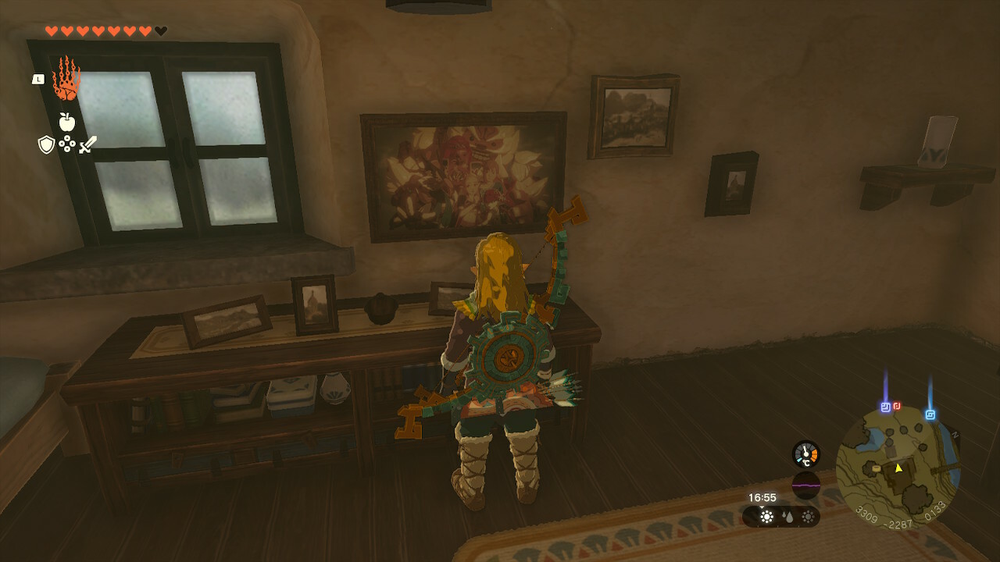



## 《游戏为什么好玩》



有些失望的一本。因为开篇写得还算不错，所以开了微信读书月卡看，看完觉得总体确实不太行。虽然作者在序言末尾已经叠甲：本书的阅读群体是新人游戏开发者、游戏玩家和对游戏化机制感兴趣的人。然而我自问确实只是一个普通玩家，怎么没法从这本书的后续内容里获取任何新的见解和启发呢？

开篇的序言和第一章《空间》写得还是不错的，有一定深度和启发；然而越往后看越觉得作者的水平撑不起长篇大论的深度分析，内容已经不止是蜻蜓点水，简直陷入了“A游戏中有x设计，B游戏中有y设计”的报菜名地狱。而这些报菜名的内容，可以说但凡是我接触过的游戏，提及的内容要么是我在游戏过程中就可以轻易的感受和领会到的，要么就是在制作人采访中已经了解到的。

举一个典型的报菜名例子：第六章中提及钩索几乎成为3A游戏的标配设计，然而只是简单的描述了《蝙蝠侠》《只狼》中使用了钩索设计，以及钩索机制产生的两个原因（减少大地图赶路的负反馈，需要跨越更高空间的机制）。但我想看的分析内容是：《只狼》相比于《黑暗之魂》，在拥有了钩索这一具有高度机动性的技能之后，在箱庭设计上是如何扩展的？又是如何在引入Z轴后，进行更丰富、更立体的地图空间设计的？

我特别讨厌3A游戏中滥用钩索的设计。除开地图设计一贯优秀的 FS 社，在平庸的地图上，钩索的滥用会使游戏玩法极度无趣和同质化。此处点名批评索尼的第一二方，看似完全不同的游戏，你的实际体验是：日本战国，但是钩索；21世纪的美国，但是钩索；西幻世界，但是钩索。别惦记你那钩索了！

等到作者开始讲 RPG 角色塑造，并开始大谈《旷野之息》本篇米法和帕雅的侧写如何成功的时候，我简直被气笑了。我认为《旷野之息》本篇米法的人物塑造相当失败，角色的塑造重心几乎全都都放在了对主角毫无道理的爱恋上，而明明应该是青涩隐晦的单向暗恋，实际在卓拉全族人尽皆知，几乎是按头玩家接受这段感情。简中翻译自带立场的强加情感更是让这段剧情的离谱程度雪上加霜——一个高自由度的开放世界游戏，在卓拉王问林克“和你感情那么深厚的米法，你都忘记了么？”的时候，玩家居然只能在“今生今世我永不会忘记她”/“我们从未分离”两个情感色彩强烈的选项中二选一，这几乎是我在整个野炊最不爽的一段剧情了。

米法在本篇中人物塑造的失败，很大程度上在DLC《英杰之诗》中才得到弥补。一是日记中补充了米法对林克情感的来源，才将这份毫无理由的、投射向玩家的情感修正为投射向百年前沉默寡言的天才剑士、被剑选中的勇者林克本人的；二是增加了塞尔达与米法的一段剧情，补充了米法作为英杰，对守护卓拉这一责任的坚持、对家人的情感；三是《英杰之诗》最动人的最后一段剧情：在灾厄尚未降临的海拉鲁，众人齐聚海拉鲁王城的花园，在塞尔达与乌尔波扎提及希卡之石的照相功能后，米法有些小心翼翼的请求塞尔达说，用它给大家拍一张合照吧。

如何才能好的描述一段从未宣之于口的单恋呢？在鼓起勇气提议合照的背后，掩藏的也只是想和喜欢的人有一张合影的少女心事。然而百年之后，这张照片已经成为生离死别后与战友们仅剩的纪念。在这段剧情之后，我终于和米法的塑造和解。

《旷野之息》本篇中并不缺少成功的侧写剧情，然而并不是这本书中提及的极为失败的米法线或是帕雅线，而是林克本人的感情。作为一部讲究代入感的作品，《旷野之息》在林克的主体性塑造上极为克制，但这并不代表林克本人没有自身的情感。野炊的林塞线是极致的东亚式含蓄表达，在林克找回所有回忆后，结局动画会由塞尔达奔向林克变为林克奔向塞尔达，而山丘上会开满漫山遍野的静谧公主，空中则飞舞着漫天飘扬的花瓣。而在游戏中途的某个支线中，某位 NPC 曾经说：不断落下的花瓣，象征绵延不绝的爱意。我认为这才是游戏表达形式中足够成功的侧写。

## 《对我无害之人》



读的过程中一度怀疑东亚人的情感是否是共通的。文字描写的笔触非常细腻，像山间隐秘的溪水流过胸口，而情感则像幽微的云雾一样笼罩。大概我们的情感与人际关系并不像莎士比亚式的戏剧，没有热切的相遇或是撕裂般的别离，然而正是这种复杂微妙的感情会让我在某一刻感同身受。

读《祥子的微笑》时的某一刻忽然被击中，想起我故去的外公，想到我们与亲人从不谈爱；读《你好，再见》中战争的仇恨导致普通人友情的疏离，《米迦勒》中世越号社会事件下普通人的亲情，都给人击中胸口般的钝痛。不过最后两个短篇我倒是完全没有共情到，感觉有点不知所云。

## 勇敢的心：世界大战



加入心愿单很久终于通关的游戏。曾经在不同平台看到游戏名"The Great War"被译为“伟大战争”，觉得实在离谱，玩到官中后发现居然是官译。谁叫你这么翻的？

之前试玩过英文版，因为对照翻译有点累所以没玩下去。其实游戏流程内没有对话，但过场动画与每一节提供的战争相关的史实有比较多需要阅读的文本。中文翻译质量确实不太好，只能说能看吧。

游戏类型是横版过关+解密，讲述一战时期几个普通人的遭遇，以及他们在战争期间相互交织的命运。游戏本身使用了绘本式的美术风格，剧情的展开比较简单直白。期间穿插的史实与物品收集给游戏增加了几分真实和厚重感。缺点是剧情上不同人物之间的联系建立的有点刻意和粗暴了，以及几个主角在战场上好像怎么都不会死；另外就是一共只有两个女角色，怎么还都有一个爹，感觉含爹量有点高了。

就战争题材而言，游戏在反战这一主旨上表达的相当成功。借由主角的遭遇引导出玩家的共鸣，没有情感的宣泄，像是闷雷一般沉默无声的控诉。在为人熟知的一战史——马恩河战役、凡尔登绞肉机、毒气战、坦克一一登场之后，游戏戛然而止在1917年的贵妇小径：在目睹战友被指挥官逼迫冲向前线、紧接着如苇草般倒下之后，我重新拥有了对角色的控制权。这本应该是个只能遵循制作者意图的线性游戏，但我没有移动，没有尝试探索，我在这个游戏流程中都尽量避免杀人，但在这一刻，我下意识对着那个指挥官按下了攻击键。

——这是我的决定，我的选择，如果他应该上军事法庭，请让我上军事法庭吧；如果他应该上绞刑架，那么请让我上绞刑架吧。不必等待1918年11月11日的凯歌，政客庆贺的胜利果实只是喂饱苍蝇的血肉。

在被摧毁的平凡生活面前，一切宏大叙事都显得空洞和虚伪。作为普通人，永远不要召唤战争。

## 韦尔比耶音乐节管弦乐团音乐会

开场的心情是在国内音乐厅别想好好听提琴的 solo 部分。小提琴本身声音没那么大，必然被观众的杂音打断，现在呼吸道疾病高发，观众席咳个不停，还有掉手机的，完全进入不了状态。伊萨依的e小协旋律我很喜欢，然而 solo 部分被吵得完全没听进去。之后的柴可夫斯基洛可可，大提琴和长笛的呼应很动人，然而大提琴的 solo 虽然比小提更容易听清一些，但还是会被吵到，因为观众席咳得更不克制了。

我来主要是想听圣桑二钢协，到圣桑二的时候确实感觉好起来了，不是观众不咳了，主要是钢琴它，声音比较大……

什么叫做乐器之王啊！

圣桑二这首曲子本身太美丽了，小马好强，乐团呈现得也很不错。不过可能是 VFCO 这次来的乐团编制比较小，第三乐章临近结尾的一段由乐团负责的动机居然被钢琴的声音盖过去了。我特别喜欢第三乐章的那个动机，好可惜。

结束之后小马甚至中场安可了一段独奏，亨德尔的G小调小步舞曲，就是我放在开头的BGM。小马演绎得像水晶一样，太动听了……

下半场的贝七其实我在听录音的时候没有特别喜欢，但是现场演绎的层次特别丰富特别清晰，可以很清楚得分辨出各个声部发出的声音，弦乐的弱奏处理得特别动人，听完现场之后感觉真正理解了贝七，名副其实的酒神盛宴。

这场指挥特别可爱！打了中文小抄，开头结尾都在和我们讲中文，指挥是匈牙利人，第一首安可是《匈牙利万岁波尔卡》，非常欢乐激昂能调动情绪的一首曲子，中途指挥面向观众示意之后全场开始打拍子，氛围特别好特别开心；第二首安可是《浏阳河》，结尾首席小提琴的抒情非常曼妙。结束的时候都22:22了，非常有诚意的一场，出音乐厅的时候感觉自己都被这种情绪感染了，吹夜风的时候脸上都带着笑。

一月听完邓泰山之后我想听交响于是订了 VFCO，这次听完之后我我好想听编制完整的交响啊……近期本地没有合适的演出了，于是订了下个月的港乐贝三，希望能听到配置全一些的，更希望能感受一下高素质观众，祈祷nia。