在 Live 现场的时候还没觉得有什么特别值得一玩的项目，一直在吐槽排队真的太累了；等到回家休息了一天，周一恍惚地走向写字楼，回归了日复一日的打工生活，才开始想念 Live 的氛围。而到晚上回家，看见挂在门后的两个帆布袋时，才仿佛终于给这段回忆起来像梦一样的旅程找到了切实存在过的证据。

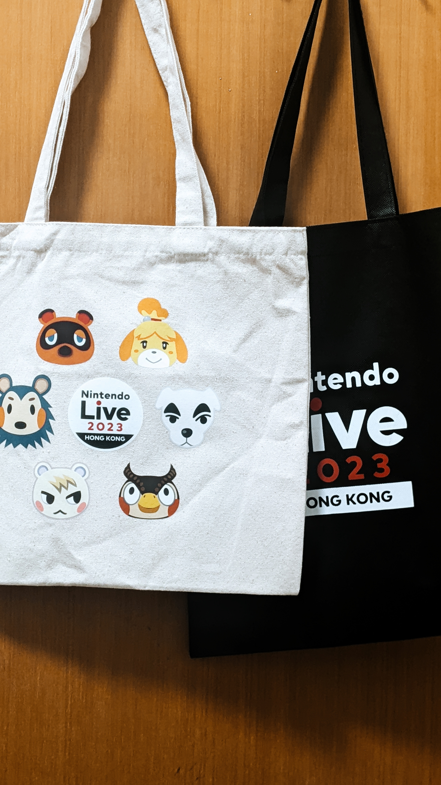

---

周六当天醒得意外的早。但抢到的 Live 票时间是11:00，说是可以迟到，不能早到。到展馆附近之后吃了个麦，当时因为点餐机后面有人排队，没来得及找奶昔，点了个安格斯。感觉这个安格斯比之前在大陆的店吃的好吃，没有那么柴，汁水很足；但薯条不行，感觉烤得太干太硬了。

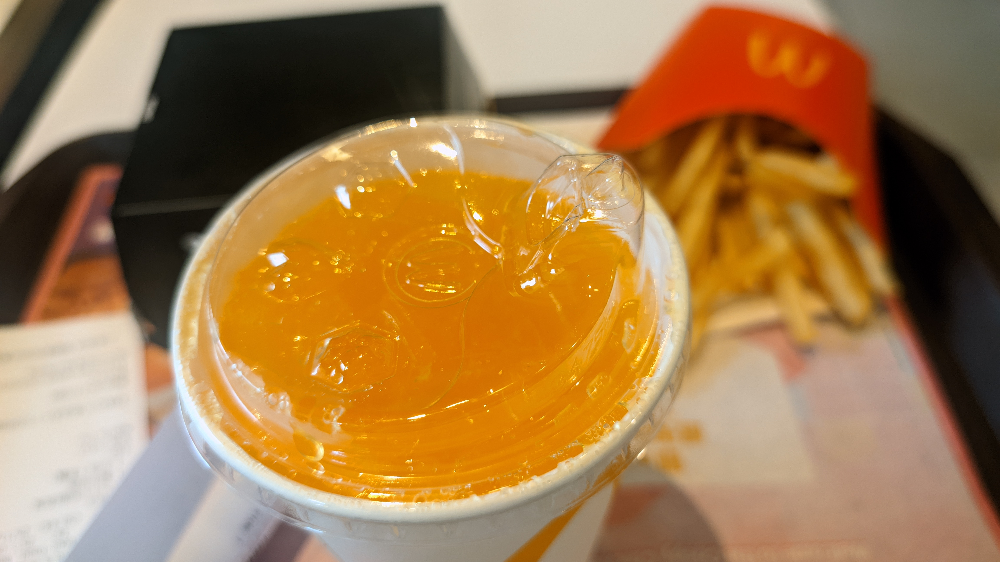

吃完大概是11:30，前往香港会议展览中心。一层中心位置有一名会展的工作人员指路。一开始他在用粤语问大家想去哪里，我不太会讲粤语，不敢问，准备随波逐人流的时候，他又用普通话问我想去哪里呀，我担心他不知道什么任天堂，沟通起来不方便，于是指了指当日展出安排里最上面一行的 Nintendo Live 2023 HongKong，说去第一个，结果他了然道：“任天堂啊！走面前的扶梯就行！”

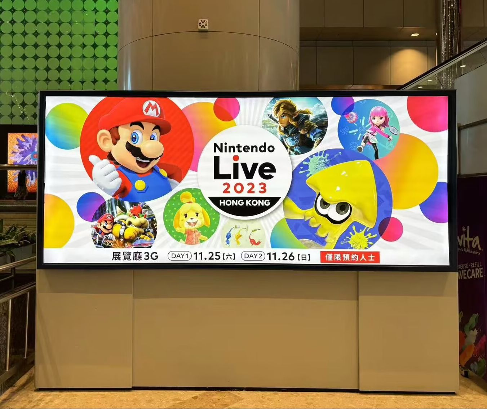

会展中心毗邻维港，在数层高的扶梯上向玻璃窗外远眺，可以看见维港上驰过的游艇，以及远处的香港摩天轮。

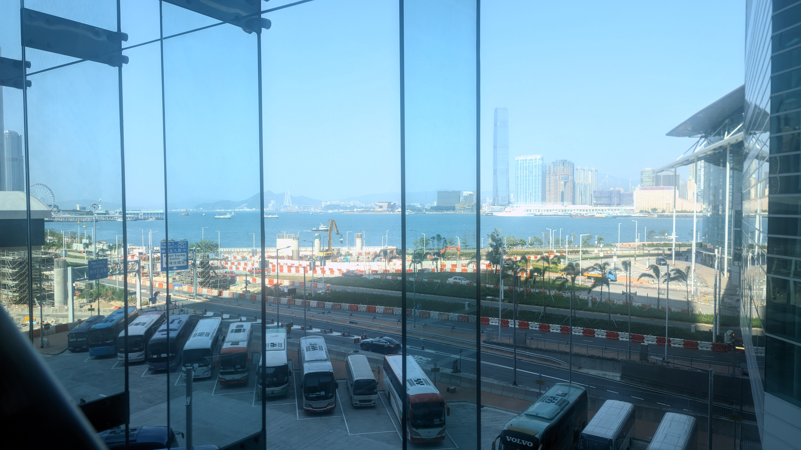

因为可以迟到，不能早到，所以我到了之后直接就能进去了。扫了预约码和 Nintendo Account（我直接用的日服的，也可以用），入场领了手袋和赠品，还有一个集贴纸的扇面，可以通过去每一个展位试玩对应游戏获得贴纸。入场之前给了一张手提袋工作坊的说明书，我原本想定制一下动森款（有妹妹和豆狸粒狸），但去的时候说是已经没有了，于是领了动森的默认款。后来得知是分时段限量的，定制款会在下一个整点重新补货。

领完手袋之后其实有点迷茫。原本一开始就想去排塞尔达的，结果据说是需要两个小时，这才先去领了手提袋。于是闲逛了一圈，随便排了一个动森的队伍。其实我都不知道排队是在排什么！到了之后发现是每张桌子上有一个动森限定的 Lite，是动森开荒状态的试玩。

其实我玩过了呀！但 staff 递上来示意说明书的时候，我还是不敢表现的太敷衍，他说你可以尝试钓鱼、捕虫、收集木材和 DIY，我认真的嗯嗯嗯，然后开始八倍速执行。执行完毕之后，获得了本次的第一张贴纸！

动森的布景特别还原，会定时出现西施惠。而且动森还是整个 Live 唯一一个有 BGM 的展区，就是那个登录页面的音乐：得得得得得～得得得～得，得得得得~得得得（）

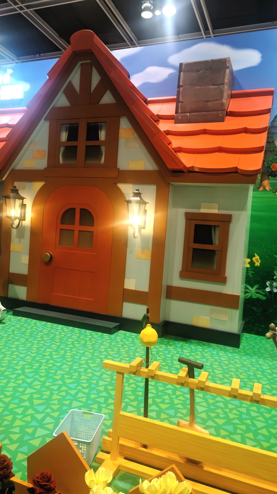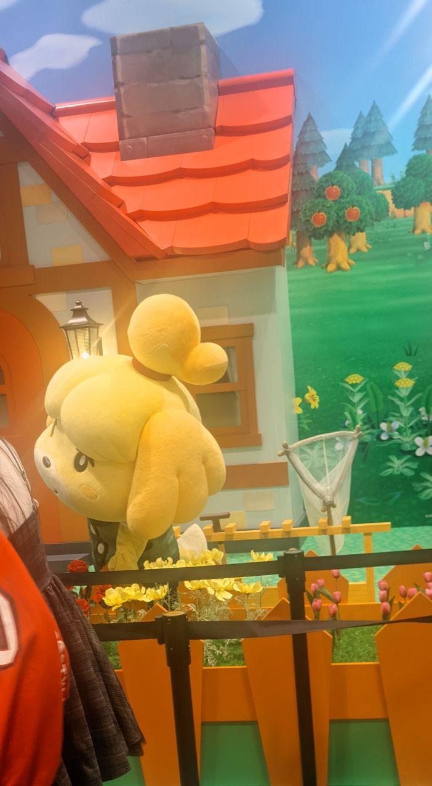

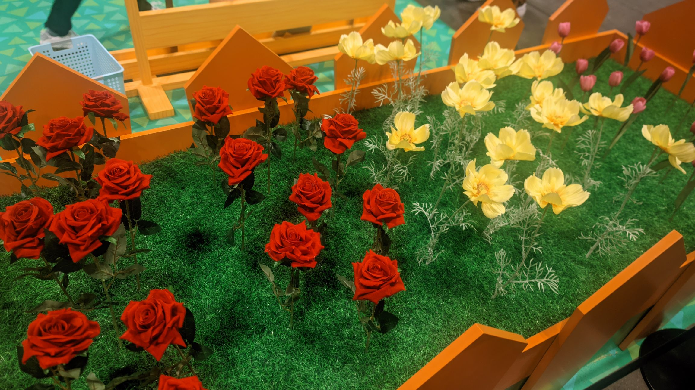

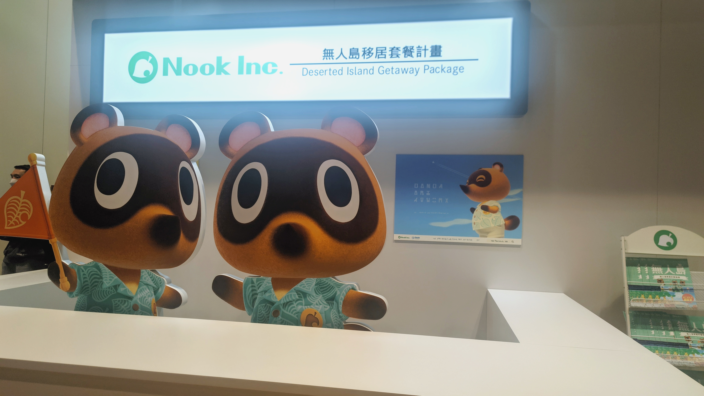

排完动森去问了一下塞尔达神庙挑战现在需要多久，结果说是需要三个小时。太惊人了！于是决定去排我没有玩过的皮克敏。

排队的时候发了一个皮克敏的帽子，戴在头上，融入人群！还给了一张卡片，可以扫出一个 AR 小游戏寻找皮克敏，但我的浏览器上好像显示有点问题，无论是皮克敏还是物品都显示不出来。

排到之后老老实实的玩了十分钟，感觉皮克敏并不是我会喜欢的游戏类型。

这之后再看了一下，各处的队伍都长得惊人，商品区甚至截止排队了。展台那边还有零星椅子可以坐，去休息了一会儿，看了两局马车比赛，其中一局终点线之前四位逆一，好刺激！

路过卡比区的时候看到了卡比，好可爱！

感觉马里奥那边也有好多人，想试玩惊奇，但人太多了。不过马里奥那边有发马里奥的帽子，那边一整片都是红帽子，好想融入噢。

权衡了一下，觉得自己这一趟来必须要做的事情是神庙挑战。于是做足了心理建设，去排神庙挑战。结果喜提了近四小时的排队……似乎是1:40左右开始排的，5:35 才打完出来。朕的腿！

排队的时候眼睁睁看着别人掏出 NS 开始打，大腿都拍断了。来之前我想这是官方展会，到哪里都应该有官方提供的 NS，我有什么必要自己带一部 NS 呢？来了之后发现到处都要排队，这种场合，真的特别需要一部自己的 NS……

中间听到展台那边好像在玩 Everybody 1,2, Switch! 好热闹啊，这可是难得一见的百人场，我也想围观，可是我在排队。

站得实在太累，而且很困，甚至席地而坐了一段时间。期间听见边上的人在打雀并讨论，于是也排了一把三人半庄，放铳，输得很惨。没有 NS 的排队人生，果然是相对失败啊。

排到三个小时的时候，因为队伍正对马里奥和路易基的 SD 口，得以毫无遮挡的看到了两位任天堂顶流（？），马里奥出来的时候甚至朝我们队伍这边挥手打招呼。而且因为队伍这边可以看到马里奥的拍照区，我这时候又已经几乎排到展区外队伍的最前方了，因此还完整的看了一轮马里奥和路易基的合影。

我的评价是：马哥不愧是任天堂一哥！互动真的很专业。原本我对角色见面会的预期只是会有人物站桩拍照，结果马里奥 staff 专业的仿佛像从迪士尼进修回来。会对游客的互动做出很及时、很专业的肢体语言回应（上午甚至有桃花公主的coser，马里奥看到后很自然的用肢体语言表现震惊，并手画爱心送出），对于小孩子更是尤其友好和热情，在小朋友过来拍照时，会很热情的主动蹲下打招呼并和小朋友握手，甚至用鼻尖碰小朋友的脸。嫉妒使我变形，到底是谁在这么小的时候就能玩上任天堂游戏，还能够被家人带到 Live 现场，甚至见到游戏里的角色，并得到这么亲切的互动……不敢想象如果能这么长大，我会有多开朗。

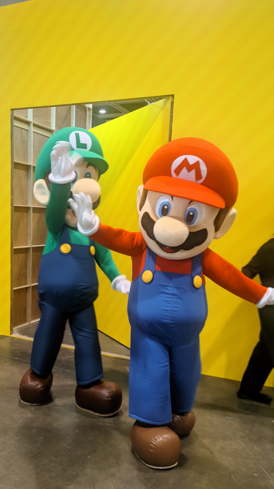
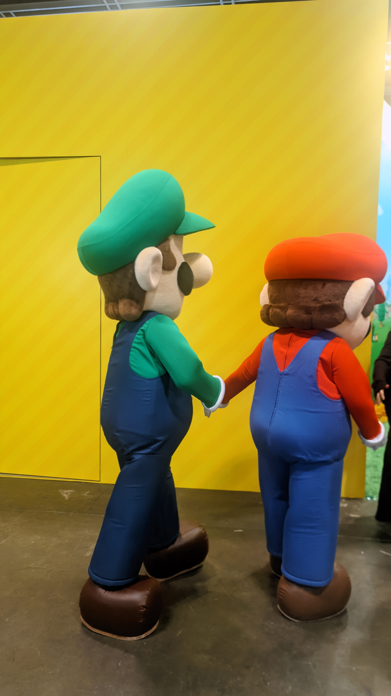

远远看了一轮马里奥的拍照互动后，感觉自己也回了一点血。这时候 staff 点人数进场了，进去之后发现进了内场还要排队，不过这时候可以围观前面的人挑战了。因为队伍的位置原因，感觉右边第一个机位的人好惨啊，会被所有正在排队的人围观。

我等待的时候也很紧张，要是我排了四个小时，结果耻辱下播，那可怎么办呀！

塞尔达区的4+12个机位的 pro 手柄全都是王泪限定，挑战区的台面甚至做成了究极手图案的圆形，好用心（也好贵）的布展！

轮到我了之后因为账号是4颗心+1圈体力，打上升的时候就翻车了一次，直接被打死了……而且基本听不见游戏声音，好像也没有手柄震动，不知道通天术是否可用。读档重来之后，有惊无险的过了。然后打水流，开局的平台就被炸弹炸了，无语的下水游泳，好在正常的爬上了楼梯。结果在二层还剩一个魔像的时候好像被三层的大魔像注意到了，于是脑子一抽直接通天术到了三楼，结果一边朝着近战魔像丢冷冻果，一边防着二楼的电箭；把三楼近战魔像推下去之后先是挨了一下电箭，走路走着又掉到了二层的水里……我服了。把二层魔像的船移开之后我都不敢看了！因为好像另外一艘船也飘过来了，不知道它到底掉没掉水里，还是被推到了了另一艘船上。好在上方血条归零，staff 接过手柄，停止计时后，我长出一口气。时间还剩2:30秒。

如果是第二天的8分钟+加载不暂停时间我应该是过不了的，不过我是 Day1！所以还是拿到了奖励，哼哼。

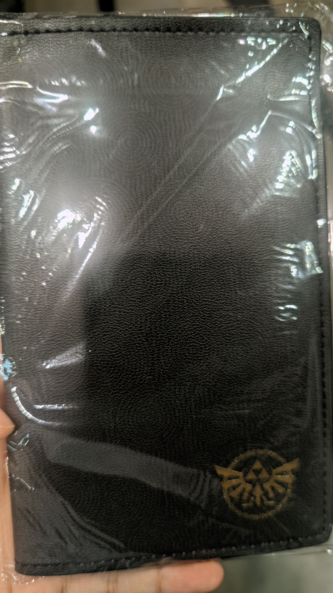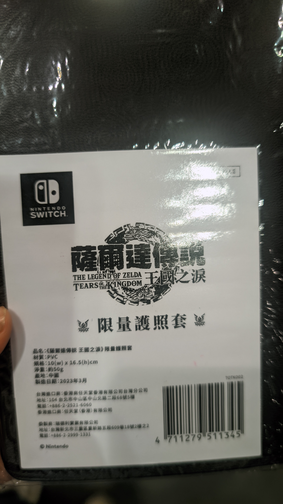

这个护照套其实做工确实一般，而且味道好刺鼻，放在阳台散味了三天。就，做个纪念吧！

在塞尔达区拍了点照片！还请 staff 给了我一张王泪的宣传页，我买的数字版，想要那张卡带封面的图嘛。

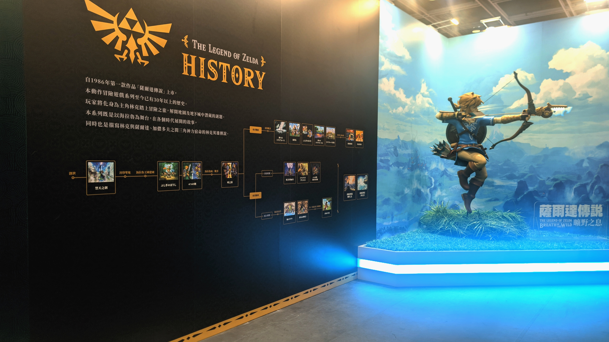

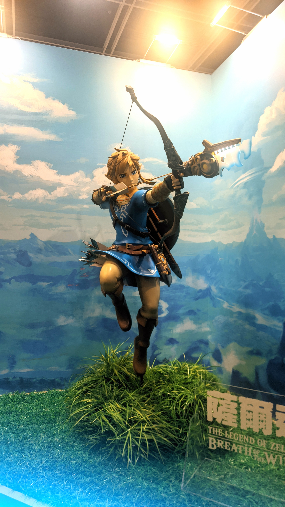

这时候大概17:40，能感觉到挺多人都已经离场了。实在站得太累，去展台底下的凳子休息了一会儿。

看了一眼喷喷的 4v4 感觉一去就能很快排到，很久没打喷喷了，去排了一局涂地。武器实在太多，没找到银喷，拿了我第二喜欢的北斋大比兜。对面好像有一家三口，有一个人似乎不太会打，中途在交接手柄，以至于我们开局的时候有点压家了。发现压家之后我们都下意识的后撤了一些，但似乎没有人准备停战跳舞，打到了最后，大概60:40的样子。

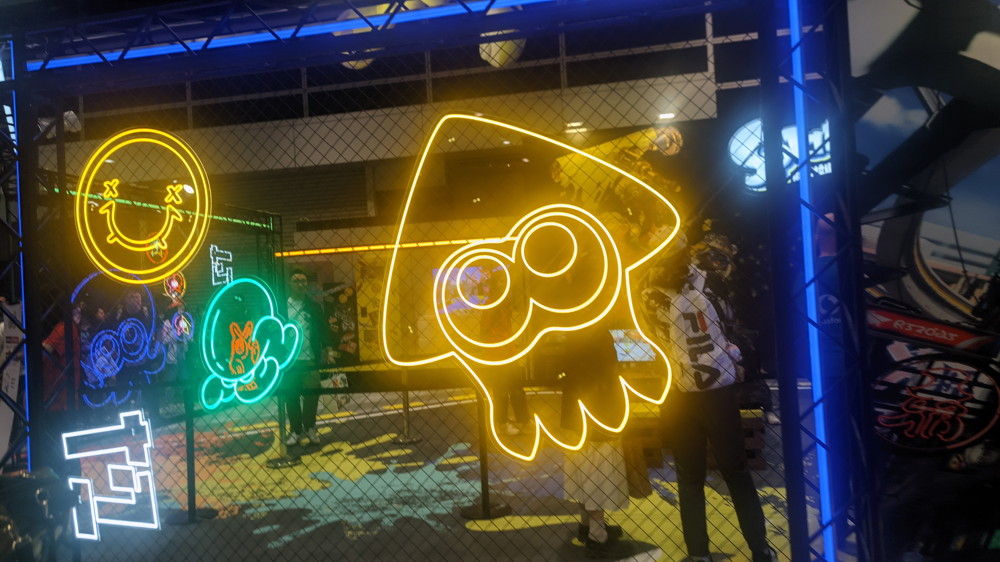

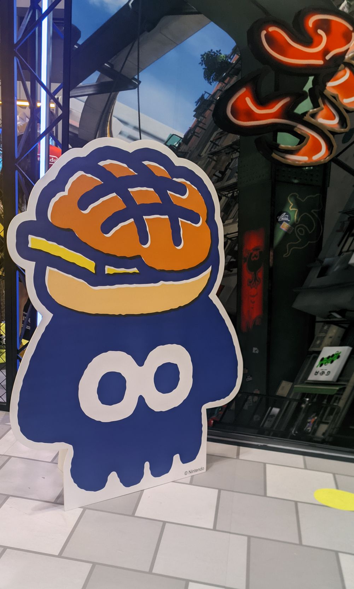

然后去马里奥区看了看，挑战不可以排了，但是试玩机器空下来了挺多。我拿了马里奥的帽子！但是感觉拿的太晚了呀，都没什么机会戴了。进场，找了一台空机器试玩惊奇。感觉惊奇确实蛮不错的，手感上没有惯性这一点在2d马里面对我来说实在加分，何况还有我最喜欢的小花，我一定会找时间买来玩的！

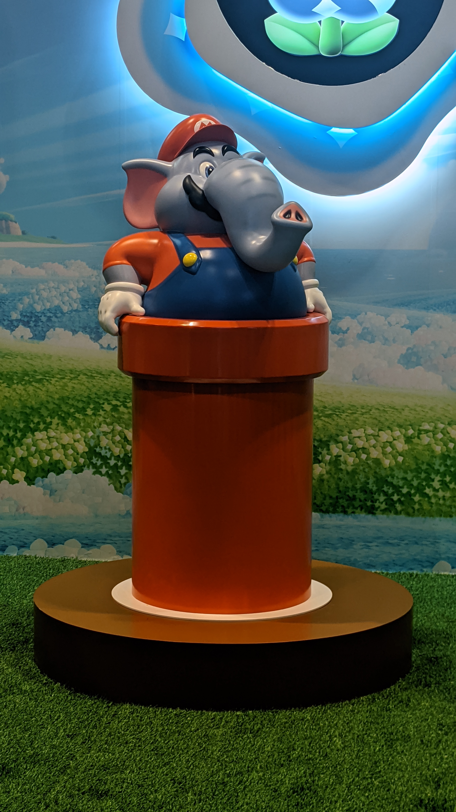

这个时候还差卡比、Sports、宝可梦的贴纸。卡比似乎截队了，没好意思过去要贴纸。Sports 因为宣传的时候说是亲子活动，而我又是一个人来的，不知道能不能玩，也没有去，现在感觉有点可惜。宝可梦我则是因为完全没有接触过所以没去（你看我都叫它宝可梦了！）。还有那个填反馈问卷送文件袋，我也完全不知道，回来后刷社交媒体才知道的，好可惜呀！

这个时候商店好像还是排了两圈人，我实在排麻了，就没有去。因为怕饿死，准备在香港吃一下晚饭，所以大概六点十几的时候离场了。

结果因为吃饭的地方也要排队，我一怒之下走了！我排了一天队，站都站不住了，你以为你是任天堂吗？休想再让我排队！最后吃了点小吃就回程了，回家之后点的外卖。这样看还不如多呆一会儿等到闭展，还能再逛逛商店或者去试一下 Sports 呢！听说如果闭展的时候再走，staff 们会在门口站成一排挥手告别，真的走早了呀。

鉴于我写这篇文章的时候已经忘了排队的苦了，感想是除了因为机位太少导致排队太久以外，其它都挺好的。布展特别用心（应该算是 Live 标配？），元素特别丰富，甚至有巨大的飞天卡比和飞天鱿鱿。展区之间布局清晰，体验区和合影区的队伍也完全不会打结。staff 都特别友善，我一开始到的时候发现是纯粤语环境，还挺紧张的。然后真正交流的时候发现如果他们发现你懵了，会主动转成国语问听得懂吗？也有 staff 开场白会先问需要普通话还是白话；如果主动用普通话询问，也会用普通话回复。而且他们的普通话讲的都蛮好的，比我的粤语好了两千倍吧！后来听说有人和 staff 聊天，得知在场的 staff 中很多人也很喜欢任天堂游戏，所以才会这么热心这么友善。我就知道喜欢任天堂的没有坏人！

虽然当天抱怨了很多次排队，但真正回忆的时候还是很想念。这是港任第一年办 Live，我相信在未来，还会有机会在更大的展馆和更好的布展安排下再见的！希望那个时候可以听到交响音乐会！（跳大神）（做法）

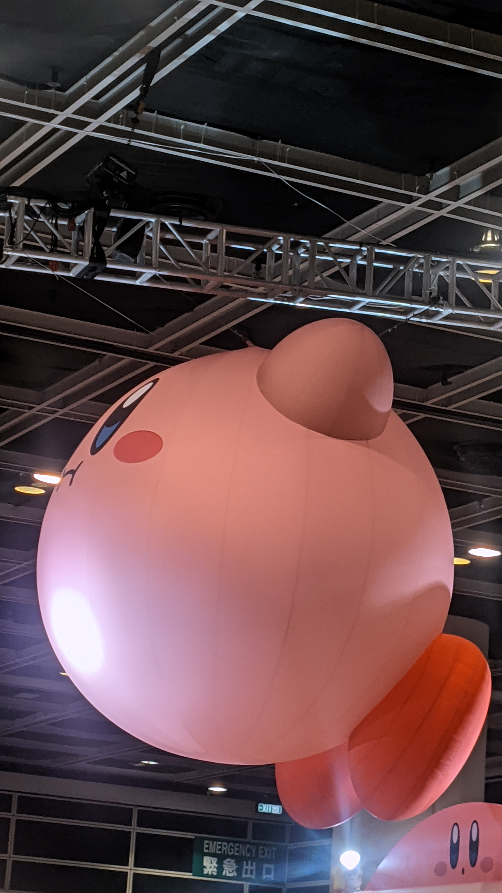

