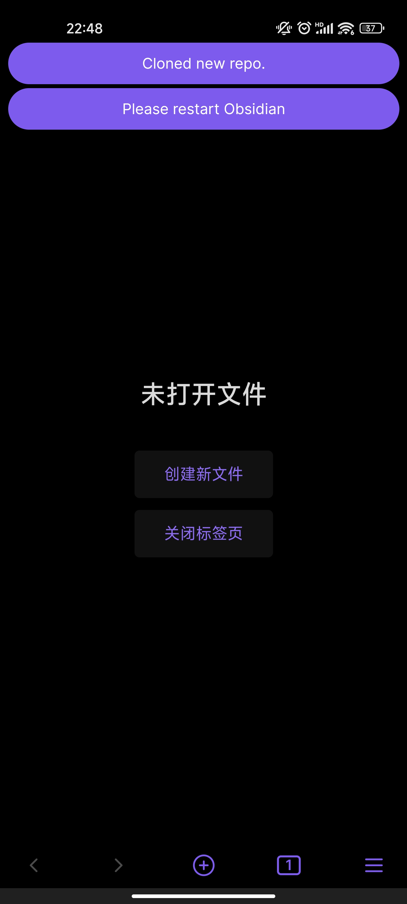
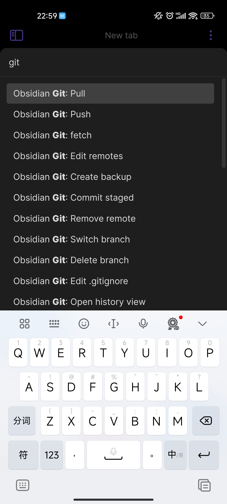
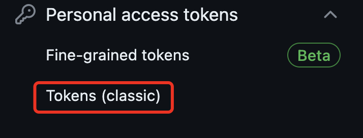
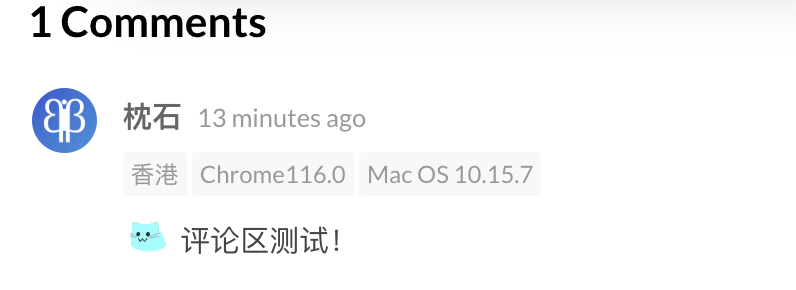

# 打造基于 Git + Obsidian 的多端同步写作工具流

## 前情提要

前文提到，本博客采用了 Github Page 零成本部署，`master` 分支就是博客源码，每次 `git push` 就会触发一次 Workflow Action，自动将最新代码编译构建到 Github Page 页面。

前文还提到，我在最初使用  VS Code 进行了博客的搭建，并使用它写了第一篇文章。VS Code 在博客项目的构建上固然很好，但写作体验则相对不尽人意，尤其是盯着和代码一样小的汉字真的很费眼睛。在 Markdown 的写作偏好上，我始终偏爱所见即所得的实时渲染编辑器。在使用了数年 Typora 直到其收费后，我开始寻找功能类似、且更适合文章管理的 Markdown 编辑器，这次我找到了 Obsidian。

Obsidian 真的相当完美，我为自己从前漫长的人生中错失了如此完美的笔记软件感到悔恨。它功能健全，体验舒适，第三方插件生态开放，你几乎可以在插件市场找到你想要的所有功能。我如获至宝，在之前的工作中已经使用了它接近一年。

简单介绍一下我的工作使用场景：我有一台 Windows 台式机和一台 Mac 笔记本，平时在工作场景使用台式机，在会议场景则会改用笔记本。因此，*多端同步* 功能对我来说至关重要。在 Google 搜索 “Obsidian 多端同步”，最常被提及的是官方提供的付费服务，或是基于如 icloud/坚果云等云服务实现的同步机制。但是这一切对我来说显然不可行，首先我不想花一分钱，其次工作方案文档不能上传到外网云服务。这两条路显然都不可行。

车到山前必有路，别看宝这样，宝可是程序员！在程序员面前提及多端同步，首先想到的第一个词就是 git。以 Obsidian + git 为关键词搜索，可以找到 [obsidian-git](https://github.com/denolehov/obsidian-git) 这个第三方插件。这就是我最喜欢 Obsidian 的地方，在成熟的社区生态下，你的想法总会有人已经实现。

obsidian-git 是一个能够将本地 Obsidian 库自动备份到远程 git 库的插件，开启并 git init 远程库后，可以定时自动发起 `git commit && git push`，在此场景下，多端共享同一份 git 项目并 `git pull`，使方便快捷且合规的多端同步成为了可能。最后，我在自己的工作开发机上维护了一份 git 存储库，并据此实现了 Obsidian 文档的多端同步。

## 博客写作场景

回到博客写作，在我把博客接入 Obsidian 和 obsidian-git，得到了一个相当丝滑的使用体验。如果是单纯的写作，我不再需要输入3次命令行，只需要在 Obsidian 命令面板选择 git commit 和 git push，就可以轻松的发布博客。

而我面临的新问题就是：虽然 PC 端写作的效率更高，但整段的写作时间对我来说相当奢侈；手机端的记录尽管碎片化，但也更加方便快捷，能让我在闲暇时间进行一些轻松的记录。

那么，有没有方法能够让我轻松的在手机电脑之间共享这份博客项目呢？

答案是有的。第三方插件 [obsidian-git](https://github.com/denolehov/obsidian-git) 支持手机端，神中神。

起初我在搜索 "obsidian+git+android" 这类关键字时，提到的方法是使用安卓端的第三方 git 客户端比如 gitJournal，或者 termux 这样的命令行工具来进行 git 库的下拉，再把已下拉的库在 Obsidian 打开并使用。我折腾了很久，尤其是关于 termux 的 ssh （在安卓用命令行真的太不方便啦！），屡屡碰壁，最后终于把库拉下来，再在 obsidian 内执行 pull 的时候报错，提示不支持 ssh 。

经过对这个问题的搜索，我到达了 obsidian 的某个 issue，issue 内关联了 obsidian-git 的[官方文档](https://github.com/denolehov/obsidian-git/wiki/Installation)，Mobile 的部分就是正确的食用方法。不需要第三方的 git pull，对于 github 项目，只需要在 github 账户生成一个 token 并填写到 obsidian-git 到设置内，就可以在 Obsidian APP 内进行一切 git 操作。

在漫长的 initialization 后，手机端的 Obsidian 提示 Clone 成功，在电脑端简单 push 了一个新 commit 之后，手机端的 Obsidian 也成功 pull 到了这个新的 commit。




前面提到，每次 push 都会触发一次新的 Github Action 构建博客，这也就意味着，我只需要在手机端 Obsidian 执行一次 git commit 和 git push，就可以将我在手机端的写作同步到博客页面。当你看到这篇文章，意味着我使用了手机端进行了第一次成功的博客发布。

而你，obsidian-git 的作者，才是真正的英雄。
### 流程与问题排查

正常流程：[官方文档](https://github.com/denolehov/obsidian-git/wiki/Installation#mobile)

但很遗憾，我的过程并没有这么顺利。记录几个踩到的坑。

#### git push error: 403

403 Forbidden 一般是权限问题，见 [Git Plugin Obsidian Android](https://www.reddit.com/r/ObsidianMD/comments/zj5629/git_plugin_obsidian_android/) ，提到如果使用了GitHub 新提供的细粒度令牌(Beta)，就会报这个错，必须要使用传统令牌并给足权限。


#### git push: buffer error

git push 报错 buffer error：这个问题我排查了很久，因为 [#Issue 307](https://github.com/denolehov/obsidian-git/issues/307) 众说纷纭，我一开始也认为是缓存不足导致的错误或者未修复的程序 Bug。但我还是怀疑存在使用问题，其中这个回复给我很大启发：
> Because of other errors I had experienced, I had removed and re-cloned my repo more than once. In one reconfiguration, I moved my repo to a subfolder of its original location. So, originally my repo was in something like `folder-a/notes` and I moved it into `folder-a/newhome/notes`. To do this, I removed my `folder-a/notes` directory, then re-cloned into `folder-a/newhome/notes`. MY problem was that I left behind the `folder-a/.obsidian` directory.... and so, I ended up with two `.obsidian` folders in a hierarchy... so, as we know, the obsidian-git configs are under the `.obsidian/plugins` directory... and I assume there is an "up the chain" precedence in obsidian-git and with two conflicting configs, that was the cause of my "buffer error". After removing my parent directory `.obsidian` folder, my issue was resolved.

里面提到多个嵌套文件夹中同时存在 `.obsidian` 配置会导致这个问题，但即使如此我还是排查了很久。 

我的 Android 目录树：

```bash
.
├── .obsidian
├── Blog
│   ├── .obsidian
│   ├── LICENSE
│   ├── README.md
│   ├── archetypes
│   ├── assets
│   ├── config.yaml
│   ├── content
│   ├── data
│   ├── layouts
│   ├── public
│   ├── resources
│   ├── static
│   └── themes

```

排除掉父目录的 `.obsidian` 后，问题仍然存在，导致我花费了很多时间去排查其他可能性。最后我忽然想起，因为我在电脑 Obsidian 端中打开过 `Blog` 目录和 `content` 目录，会导致推到 git 的项目目录下也存在嵌套 `.obsidian` 。

我的问题 git 目录树：

```bash
.
├── .obsidian
├── content
│   ├── .obsidian
│   ├── _index.md
│   ├── _index.zh-cn.md
│   ├── categories
│   ├── page
│   ├── post
│   └── posts
```

删除 `/content/.obsidian` 后，问题解决，我成功发出了这篇文章。

另外，因为 `.obsidian` 在各端的配置不同，不建议在 git 存储库中上传 `.obsidian` 目录，避免每次变更都需要推送。方法是把目录加入 [.gitignore](https://github.com/zhen-shi/zhen-shi.github.io/blob/master/.gitignore)。如果之前已经上传，需要执行 `git rm -r --cached .obsidian/`。

# 软装记录

## 评论区，启动！

stack 主题的默认评论区是 disqus，我试用了一下觉得 UI 不是很喜欢，并且整个服务过于重了。在支持的评论服务中选了一下，选择了 UI 相对符合主题、自定义程度高、并且足够轻量的 Waline。

Waline 服务是需要自己部署的，好在它的[官方文档](https://waline.js.org/guide/get-started/)中提及的 Vercel 和 LeanCloud 提供了免费的服务端和数据库服务，并且部署过程非常友好，我丝滑的拥有了一个评论区！

这类文章的常见写法是写一下 Step123，记录踩过的坑和解决方法。但宝做专业人士很多年，突出一个经验丰富处变不惊，已经不再是会遇到无数问题眉头紧锁查阅 Google 寻找解决方案的女大了（叉腰）。

简单吐槽一下部署完之后的遇到的两个问题。第一，当我美美添加猫猫表情，发出第一条评论测试的时候，惊恐的发现：你这个评论区，为什么默认开启了 ip 属地、浏览器、设备信息展示？我一阵恶寒涌上心头，当初我就是因为 ip 属地显示逐步淡出了简中互联网！而你，一个开源评论服务，居然在做同样的事。写得很好，下次不准写了。



虽然我知道没有人会评论我，但是我不允许这样的东西出现在我的博客。一定要关掉！配置在[环境变量](https://waline.js.org/reference/server/env.html#%E4%B8%BB%E8%A6%81%E9%85%8D%E7%BD%AE) 里，是 `DISABLE_REGION`，也提到了 Vercel 需要在 Settings - Environment Variables 中进行设置。配置完之后重新构建（重新构建 Vercel 会有新的 app 地址），ip 属地，关闭！

第二个问题就有点好笑，我一开始就把评论区设置为不需要登录，并且匿名发送了第一条测试评论。之后我意识到这个评论服务是有管理系统的，文档里赫然写着“第一个注册的用户自动成为管理员”，然后我尝试注册，发现并没有如文档所说跳转到管理界面。我看了一下数据库，发现我这个账号的 id 是 2，id 1 是什么呢？是上文中提到的匿名账号，没有邮箱，没有密码，role 那一列赫然写着 Administer。

草。

事已至此，直接改 db 吧，把 id 1 那行删掉之后，我的账号成功篡位成了管理员。评论区施工，结束！

## 小小的主题改造

其实我是几乎不准备对这个主题做改造的。遥想几年之前，女大还能兴致盎然的给博客进行各种装修。现在兴致索然，并不是因为过了那个年纪，只是平时上班写代码太累，工伤了。

虽然几乎不装修，但是需要的小改造还是会做的。

1. 增加了[文字折叠功能](https://github.com/CaiJimmy/hugo-theme-stack/commit/4f9a6c775a426747021dc50e8b651b92296ff670)，因为上个月看了叙述性诡计作品，评价需要叠一下。本来准备直接抄代码，不过搜到的两个都不能直接用，还是自己上手改了，实现非常短。
2. 不知道为什么文章的子标题字号这么大，有点丑，[进行改小](https://github.com/CaiJimmy/hugo-theme-stack/commit/ecb7facbfbbd705bf5b2ff5c730a8ec47668d678)。